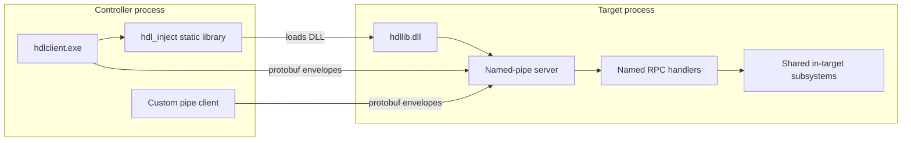

# Agent context index

This is the shortest path into the `hdllib` codebase for an automated agent or a
new contributor. It indexes behavior, ownership, and tests; it does not replace
the public API and protocol references.

`hdllib` is a Windows x64 helper DLL that runs inside a target process. It
provides memory inspection, search and discovery, code placement and patching,
calls, hooks, watchpoints, PE/code graph inspection, process fingerprinting,
health events, and further DLL injection. Controllers talk over a multi-client
named pipe (sole remote control channel). `hdlclient.exe` supplies injection, a
CLI, recipes, and a persistent interest store.

## Start here

| Need | Read first | Then inspect |
|---|---|---|
| Product overview and examples | [root README](../README.md) | [capability reference](capabilities.md) |
| Choose an end-to-end outcome | [goal-oriented workflows](workflows.md) | [client command workflows](client.md) |
| Run a concrete end-to-end investigation | [toy arena walkthrough](toy-arena-walkthrough.md) | [`tests/toy_test_main.cpp`](../tests/toy_test_main.cpp) |
| System boundaries, lifecycle, and data flow | [architecture](architecture.md) | [`src/core.cpp`](../src/core.cpp), [`src/ipc/`](../src/ipc/) |
| Find the implementation of a feature | [functionality index](#functionality-index) | domain `src/*.cpp`, [`proto/hdl/rpc/v1`](../proto/hdl/rpc/v1), [`src/ipc/`](../src/ipc/) |
| Understand an RPC method or payload | [RPC contract](rpc.md) | [`services.proto`](../proto/hdl/rpc/v1/services.proto), [`src/ipc/dispatch.cpp`](../src/ipc/dispatch.cpp) |
| Understand a CLI or recipe workflow | [client workflows](client.md) | [`tools/client/main.cpp`](../tools/client/main.cpp), [`tools/client/recipes.cpp`](../tools/client/recipes.cpp) |
| Change or extend the project | [development guide](development.md) | [`CMakeLists.txt`](../CMakeLists.txt), [test guide](../tests/README.md) |
| Configure Windows CI or the GUI runner | [CI guide](ci.md) | [workflow definitions](../.github/workflows/) |
| Work on injection | [injection index](inject/README.md) | [selection model](inject/selection.md), [`src/inject/`](../src/inject/) |
| Exercise higher-level reverse-engineering flows | [toy arena](../toys/arena/README.md) | [`tests/toy_test_main.cpp`](../tests/toy_test_main.cpp) |

## System in one graph



Typed IPC handlers adapt generated protobuf messages onto shared domain
functions. Generated client stubs serialize the messages; the CLI remains the
human/script presentation layer. When a feature changes, update the protobuf
schema, handler, CLI behavior where applicable, contract golden, and tests.

## Source-of-truth order

When documentation and code disagree, use this order:

1. [`include/hdllib/hdllib.h`](../include/hdllib/hdllib.h) for the exported ABI,
   status codes, flags, public structures, and fill-buffer contracts.
2. [`proto/hdl/rpc/v1`](../proto/hdl/rpc/v1), generated RPC bindings, and
   [`src/ipc/handlers_*.cpp`](../src/ipc/) for method identity, typed messages,
   validation, and domain conversion.
3. Domain implementation files under [`src/`](../src/) for semantics and
   lifetime behavior.
4. [`tools/client/main.cpp`](../tools/client/main.cpp) and
   [`tools/client/usage.cpp`](../tools/client/usage.cpp) for the live command
   registry and syntax.
5. Tests for executable examples and edge-case expectations.
6. Markdown documentation for intent and workflows.

There is no numeric operation registry or positional payload codec.
`services.proto` is the source of truth; the code generator derives method
traits, metadata, typed clients/handlers, dispatch bindings, and the contract
manifest.

## Functionality index

| Functionality | Contract and entry points | Core implementation | Remote/client path | Best tests and docs |
|---|---|---|---|---|
| Lifecycle, quiet defaults, logging, clean unload | `HdlInit`, `HdlShutdown` / `HdlShutdownEx`, `HdlStartIpc`, `HdlTrackLoadedDll`, log/health controls in [`hdllib.h`](../include/hdllib/hdllib.h) | [`dllmain.cpp`](../src/dllmain.cpp), [`core.cpp`](../src/core.cpp), [`loaded_modules.cpp`](../src/loaded_modules.cpp), [`env.cpp`](../src/env.cpp), [`log.cpp`](../src/log.cpp) | `Control.Shutdown` / `Injection.TrackLoadedDll` in [`handlers_basic.cpp`](../src/ipc/handlers_basic.cpp); `shutdown` in [`cmds_ipc_inject.cpp`](../tools/client/cmds_ipc_inject.cpp); `ping`/`log` in [`cmds_basic.cpp`](../tools/client/cmds_basic.cpp) | [architecture](architecture.md) lifecycle, [capabilities: injection](capabilities.md#2-dll-injection), clean-unload cases in [`test_main.cpp`](../tests/test_main.cpp) |
| Injection, target resolution, recommendation, unload/reload | `HdlInjectDll*`, `HdlResolveTarget`, `HdlRecommendInject`, `HdlUnloadDll` / `HdlUnloadDllEx` | [`inject.cpp`](../src/inject.cpp), [`inject/select.cpp`](../src/inject/select.cpp), [`inject/unload.cpp`](../src/inject/unload.cpp), one implementation per method in [`src/inject/`](../src/inject/) | Local controller path in [`local_inject.cpp`](../tools/client/local_inject.cpp); IPC inject/unload in [`handlers_basic.cpp`](../src/ipc/handlers_basic.cpp) | [injection index](inject/README.md), [selection](inject/selection.md), [`test_select.cpp`](../tests/test_select.cpp), injection matrix in [`test_main.cpp`](../tests/test_main.cpp) |
| RPC framing, generated dispatch, deadlines, streaming | `HdlFormatPipeName` in [`pipe_name.h`](../include/hdllib/pipe_name.h); schemas in [`proto/hdl/rpc/v1`](../proto/hdl/rpc/v1) | [`rpc/runtime.cpp`](../src/rpc/runtime.cpp), [`rpc/pipe_client.cpp`](../src/rpc/pipe_client.cpp), [`ipc/framing.cpp`](../src/ipc/framing.cpp), [`ipc/server.cpp`](../src/ipc/server.cpp), [`ipc/dispatch.cpp`](../src/ipc/dispatch.cpp) | Generated service clients over the shared `PipeClient`; generated service-qualified method switch in [`ipc/dispatch.cpp`](../src/ipc/dispatch.cpp) | [RPC contract](rpc.md), schema/message/live RPC tests |
| Memory read/write and region/module enumeration | `HdlReadMemory`, `HdlWriteMemory`, `HdlEnumRegions`, `HdlEnumModules` | [`memory.cpp`](../src/memory.cpp) | [`handlers_basic.cpp`](../src/ipc/handlers_basic.cpp), [`cmds_basic.cpp`](../tools/client/cmds_basic.cpp) | [capabilities: memory](capabilities.md#3-memory-read--write--enumerate), local/client tests |
| AOB and typed incremental search | `HdlSearchMemory`, `HdlSearchCreate/First/Next/GetHits/Close` | [`memory.cpp`](../src/memory.cpp) | [`handlers_search.cpp`](../src/ipc/handlers_search.cpp), [`cmds_scan.cpp`](../tools/client/cmds_scan.cpp) | [client: memory and search](client.md#memory-and-search), local/client tests |
| Passive process fingerprinting | `HdlEnumFingerprintTags`, pure `HdlClassifyFingerprint` | [`fingerprint.cpp`](../src/fingerprint.cpp), rule table in [`fingerprint_rules.hpp`](../src/fingerprint_rules.hpp) | [`handlers_basic.cpp`](../src/ipc/handlers_basic.cpp), `fingerprint` in [`cmds_basic.cpp`](../tools/client/cmds_basic.cpp), suggestions in [`recipes.cpp`](../tools/client/recipes.cpp) | [capabilities: fingerprint](capabilities.md#6b-process-fingerprint), local/client tests |
| Health, threads, events, deadlines | `HdlGetHealth`, `HdlEnumThreads`, `HdlPollEvents`; local-only `HdlJob*` | [`health.cpp`](../src/health.cpp), [`jobs.cpp`](../src/jobs.cpp) | [`handlers_basic.cpp`](../src/ipc/handlers_basic.cpp), `health`/`threads`/`events` in [`cmds_basic.cpp`](../tools/client/cmds_basic.cpp) | [capabilities: health](capabilities.md#6-process--thread-health-and-events), local/client tests |
| Address and export resolution | `HdlResolveRipRelative`, `HdlFollowPointers`, `HdlModuleBase`, `HdlResolveExport` | [`resolve.cpp`](../src/resolve.cpp), export resolution in [`call.cpp`](../src/call.cpp) | [`handlers_call.cpp`](../src/ipc/handlers_call.cpp), `rip`/`ptrchain`/`modbase`/`resolve` in client command files | [capabilities: address helpers](capabilities.md#7-address-resolution-helpers) |
| Locate: patterns, string xrefs, pointer scan, struct probe | `HdlResolvePattern`, `HdlFindStringXrefs`, `HdlPointerScan`, `HdlProbeStruct` | [`locate.cpp`](../src/locate.cpp) | [`handlers_locate.cpp`](../src/ipc/handlers_locate.cpp), [`cmds_locate.cpp`](../tools/client/cmds_locate.cpp) | [client: locate](client.md#locate-signatures--addresses), locate fixtures in [`test_main.cpp`](../tests/test_main.cpp) |
| In-process calls and UI-thread dispatch | `HdlCall`, `HdlCallExport`, `HdlCallVtable` | [`call.cpp`](../src/call.cpp), [`call_invoke.asm`](../src/call_invoke.asm), [`call_dispatch.cpp`](../src/call_dispatch.cpp) | [`handlers_call.cpp`](../src/ipc/handlers_call.cpp), [`cmds_call.cpp`](../tools/client/cmds_call.cpp) | [capabilities: calls](capabilities.md#8-in-process-calls-export--absolute--vtable), local/client/toy tests |
| Hooks and captured call traces | `HdlHook`, `HdlHookTrace`, `HdlHookImport`, enable/unhook/poll | [`hooks.cpp`](../src/hooks.cpp), [`hooks_trace.asm`](../src/hooks_trace.asm), vendored MinHook | [`handlers_hooks.cpp`](../src/ipc/handlers_hooks.cpp), [`cmds_hooks.cpp`](../tools/client/cmds_hooks.cpp) | [capabilities: hooks](capabilities.md#10-hooks-minhook--capturetrace), local/client/toy tests |
| Discover sessions, evidence, action ranking, heat, clustering | `HdlDiscover*` | [`discover.cpp`](../src/discover.cpp), with primitives from memory/locate/graph/hooks/watch | [`handlers_discover.cpp`](../src/ipc/handlers_discover.cpp), [`cmds_discover.cpp`](../tools/client/cmds_discover.cpp), [`ipc_ops.cpp`](../tools/client/ipc_ops.cpp) | [client: discover](client.md#3-discover-sessions-discover-), discover fixtures and toy tests |
| Placement and scratch allocation | `HdlAlloc*`, `HdlFree`, `HdlFindCaves`, protect/flush | [`alloc.cpp`](../src/alloc.cpp), [`place.cpp`](../src/place.cpp) | [`handlers_place.cpp`](../src/ipc/handlers_place.cpp), place commands in [`cmds_place.cpp`](../tools/client/cmds_place.cpp) | [capabilities: place](capabilities.md#13-place-caves-nearby-alloc-protect), client/toy tests |
| Disassembly, stubs, and reversible patch ledger | `HdlDisasm*`, `HdlInstrLen`, `HdlBuildStub`, `HdlPatch*` | [`disasm/`](../src/disasm/), [`code.cpp`](../src/code.cpp) | [`handlers_code.cpp`](../src/ipc/handlers_code.cpp), [`cmds_place.cpp`](../tools/client/cmds_place.cpp) | [capabilities: disassembly/code](capabilities.md#14-disassembly-backends), local/client/toy tests |
| PE metadata and bounded function/xref graph | `HdlEnumSections/Exports/Imports`, `HdlEnumFunctions`, `HdlResolveFunction`, `HdlXrefs*` | [`pe_meta.cpp`](../src/pe_meta.cpp), [`graph.cpp`](../src/graph.cpp) | [`handlers_code.cpp`](../src/ipc/handlers_code.cpp), [`cmds_place.cpp`](../tools/client/cmds_place.cpp) | [capabilities: PE](capabilities.md#16-pe-metadata), [capabilities: graph](capabilities.md#17-bounded-function--xref-graph) |
| Vtables and MSVC RTTI | `HdlWalkVtable`, `HdlQueryRttiName` | [`vtable.cpp`](../src/vtable.cpp) | [`handlers_code.cpp`](../src/ipc/handlers_code.cpp), `vtable`/`rtti` in [`cmds_place.cpp`](../tools/client/cmds_place.cpp) | [capabilities: observe](capabilities.md#18-observe-vtable--rtti), local/client/toy tests |
| Hardware/page watchpoints and hit queue | `HdlWatch*`, `HdlPollWatchHits` | [`watch.cpp`](../src/watch.cpp) | [`handlers_code.cpp`](../src/ipc/handlers_code.cpp), `watch` in [`cmds_place.cpp`](../tools/client/cmds_place.cpp) | [capabilities: watchpoints](capabilities.md#19-watchpoints-hardware--page), local/client/toy tests |
| CLI and controller | Command registry in [`main.cpp`](../tools/client/main.cpp), syntax in [`usage.cpp`](../tools/client/usage.cpp) | Controller in [`cmds_controller.cpp`](../tools/client/cmds_controller.cpp), session persist in [`session_persist.cpp`](../tools/client/session_persist.cpp) | Uses the shared [`PipeClient`](../src/rpc/pipe_client.cpp) and generated typed service clients | [client workflows](client.md), [`client_test_main.cpp`](../tests/client_test_main.cpp) |
| Durable interests and orchestration recipes | JSON v3 types in [`store.hpp`](../tools/client/store.hpp), recipe state in [`recipes.hpp`](../tools/client/recipes.hpp) | [`store.cpp`](../tools/client/store.cpp), [`recipes.cpp`](../tools/client/recipes.cpp) | One-shot controller verbs; not an IPC or DLL feature | [client: interest store](client.md#4-interest-store-and-recipes), [`store_test.cpp`](../tests/store_test.cpp), client/toy tests |

## Repository map

```text
include/hdllib/       Shared types/enums + pipe-name helper; inject callback decls
src/api.cpp           Inject callback exports only (HdlHookProc / HdlWinEventProc)
src/*.cpp             In-target domain implementations
src/rpc/              Protobuf envelope runtime, shared PipeClient, generated-client support
src/ipc/              Pipe server, framing, named-method dispatch, domain adapters
proto/hdl/rpc/v1/     First-release RPC source schemas
src/inject/           One injection technique per file plus selection/common code
src/disasm/           Pluggable built-in disassembly backends
tools/client/         Injector, pipe client, CLI, store, recipes, session persist
tests/                Domain, live IPC, injection-matrix, and toy tests
toys/arena/           Deterministic target for higher-level discovery workflows
third_party/minhook/  Vendored MinHook v1.3.4
docs/inject/          Per-technique behavior and constraints
docs/future/          Investigated but intentionally unimplemented ideas
```

`build/`, compiler products, caches, and ignored local artifacts are not source.
Use `git ls-files` when distinguishing project files from a developer's local
runtime state.

## Terms that carry architectural meaning

| Term | Meaning in this repository |
|---|---|
| In-target | Code executing inside the process that loaded `hdllib.dll`; memory addresses are meaningful only there. |
| Controller | `hdlclient` or another process using the pipe to control the in-target DLL. |
| RPC surface | Schema-generated method names and typed request/response messages in `services.proto` and the per-service protobuf files. |
| Client surface | Human-facing commands and higher-level recipes; some compose several IPC operations. |
| Search session | Mutable typed-scan candidate/snapshot state. Domain callers hold an opaque pointer; IPC callers hold a process-global numeric ID. |
| Discover session | Server-side candidate, evidence, hook, action, and heat state. It is richer than a search session. |
| Interest store | Client-side durable JSON locators. It is separate from a discover-session export and is designed for revalidation across ASLR/restarts. |
| Place | Find or allocate executable space and manage protection/cache coherency. |
| Stitch | Client recipe that creates a stub and a reversible patch linking a target to it. |

## Constraints worth retaining in context

- Windows x64 only; no Wow64 helper.
- The pipe is byte-mode with a fixed preface and length-prefixed protobuf
  envelopes. `ClientHello` / `ServerHello` negotiate the protocol and advertise
  the generated method inventory and transport limits.
- Pipe access is limited to SYSTEM, Administrators, and the target process user.
- Multiple clients are accepted concurrently. Live session IDs are process-global,
  not connection-scoped.
- Long operations cooperate with request deadlines; remote job-management RPCs
  are intentionally absent.
- A timed-out in-process call may continue after the waiter returns.
- UI-thread calls require a non-console top-level window.
- Logs and the health exception VEH are off by default after injection.
- Allocations, patches, hooks, watches, local jobs, and live sessions are process-local
  runtime state and are cleaned up during shutdown. Durable intent belongs in
  the client interest store.
- The disassembly backends are selected at runtime, but at least one built-in
  backend must be enabled at build time.

For the dependency and lifetime details behind these constraints, continue with
[architecture.md](architecture.md). For change checklists and test selection,
continue with [development.md](development.md).
