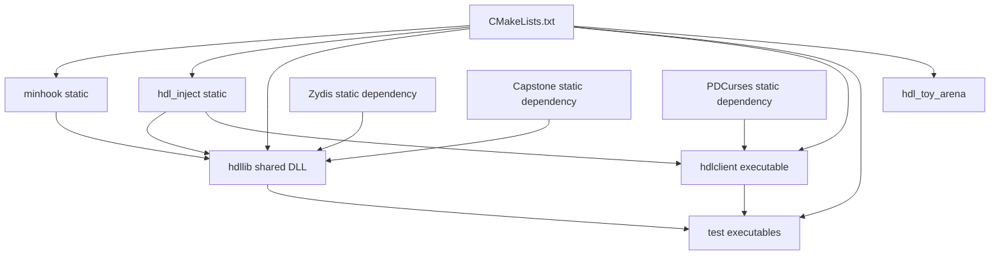
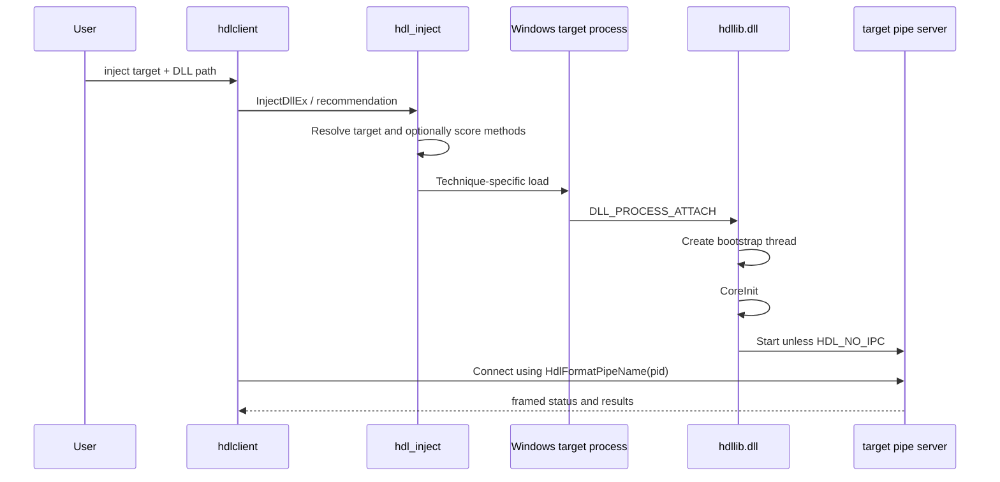
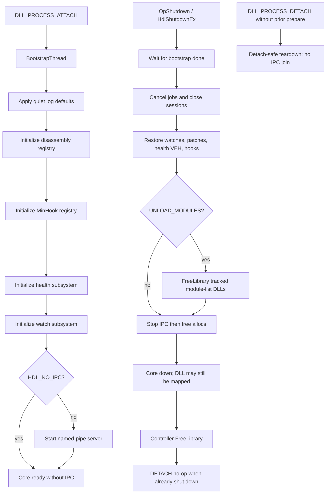
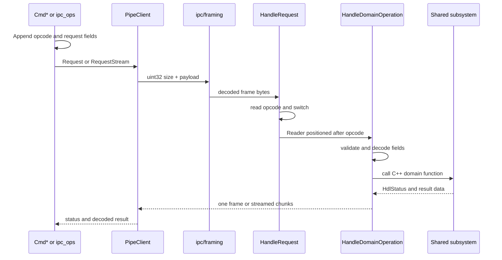
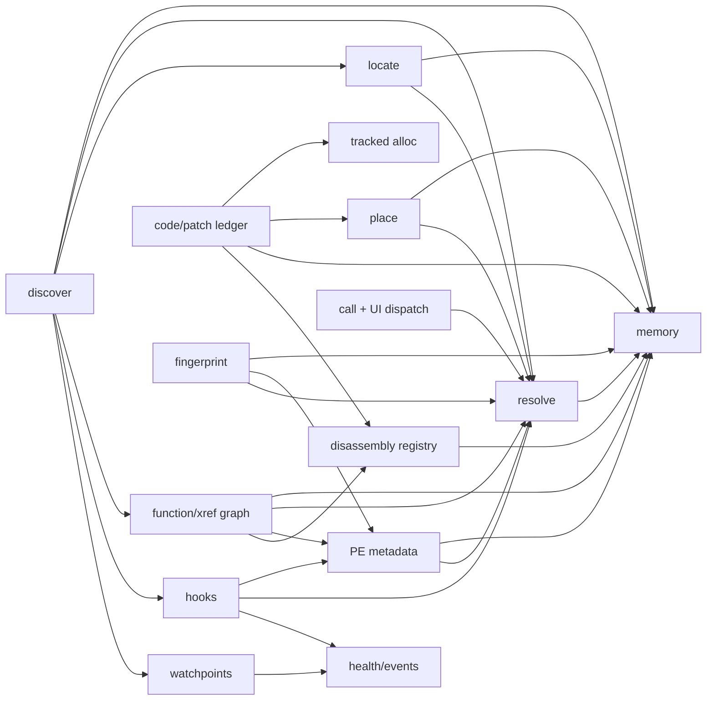
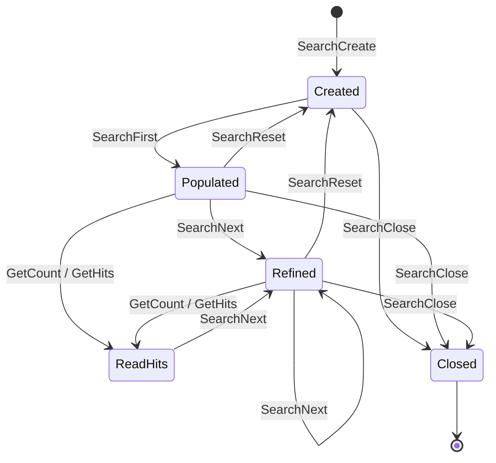
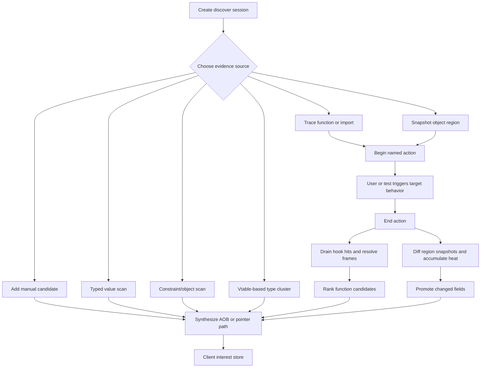

# Architecture and execution flows

This document explains how the tracked source fits together. See
[the agent index](README.md) for a feature-to-file lookup and
[capabilities.md](capabilities.md) for exact public and wire contracts.

## Build-time components

`hdl_inject` is deliberately separate from `hdllib.dll`: the controller needs
injection before a target-side pipe exists, while the DLL also exposes injection
through IPC (and inject helpers in `hdl_inject`). MinHook is vendored. Zydis, Capstone, and optionally
PDCurses are populated by CMake.

## Runtime boundaries

There are two distinct execution phases:

1. Controller-side injection chooses a technique and loads the DLL.
2. Target-side operation begins when the DLL bootstraps its subsystems and pipe.

An address returned by an IPC operation belongs to the target process. Domain
APIs used by in-process tests operate on the calling process address space.

### Injection dispatch

[`src/inject.cpp`](../src/inject.cpp) is the single method switch.
[`src/inject/select.cpp`](../src/inject/select.cpp) resolves PID/HWND targets,
probes a `TargetProfile`, scores the requirement catalog, and picks `AUTO`.
[`src/inject/techniques.hpp`](../src/inject/techniques.hpp) enumerates the
implementation entry points; each technique owns one `.cpp` file.

Injection methods operate in the controller process and use Windows remote
process/thread/window mechanisms. After the target maps `hdllib.dll`, its normal
DLL lifecycle takes over. Early Bird is the exception to attach semantics: it
creates a new suspended process and is never auto-selected for a PID attach.

## DLL lifecycle

[`src/dllmain.cpp`](../src/dllmain.cpp) defers initialization to a new thread to
avoid doing MinHook, thread, and pipe work under the loader lock. Explicit unload
should call `OpShutdown` / `HdlShutdownEx` **before** `FreeLibrary` so teardown
also runs off the loader lock; `DLL_PROCESS_DETACH` only runs a join-free residual
path if prepare was skipped.

`CoreInit` and `CoreShutdown` / `CoreShutdownEx` / `CoreShutdownPrepare` are
idempotent through an atomic flag plus a bootstrap barrier so unload cannot race
an incomplete init. Initialization rolls back already-started subsystems when
hooks, health, or IPC fails. `DLL_PROCESS_DETACH` skips teardown during process
termination (`reserved != nullptr`) and uses `CoreShutdownDetach` (no thread join)
on explicit unload.

## IPC request path

The server uses one accept thread and a joinable worker per connected client.
Each worker reads and handles requests serially for that connection; different
clients run concurrently. On stop, the accept thread cancels I/O, joins workers,
then closes session/job maps.

The layers are:

| Layer | Ownership |
|---|---|
| Pipe name and ACL | [`include/hdllib/pipe_name.h`](../include/hdllib/pipe_name.h), [`src/ipc/framing.cpp`](../src/ipc/framing.cpp) |
| Frame I/O and 64 MiB frame cap | [`src/ipc/framing.cpp`](../src/ipc/framing.cpp) |
| Accept loop and client worker lifetime | [`src/ipc/server.cpp`](../src/ipc/server.cpp) |
| Opcode numbers and primitive encoders | [`src/protocol.hpp`](../src/protocol.hpp) |
| Opcode-to-handler switch | [`src/ipc/dispatch.cpp`](../src/ipc/dispatch.cpp) |
| Request validation and response encoding | [`src/ipc/handlers_*.cpp`](../src/ipc/) |
| Client transport and stream reassembly | [`tools/client/pipe_client.cpp`](../tools/client/pipe_client.cpp) |
| Human command parsing and presentation | [`tools/client/cmds_*.cpp`](../tools/client/) |

### Wire invariants

- A request frame is `uint32_t size`, then `size` bytes beginning with a
  `uint32_t opcode`.
- A normal reply payload begins with `int32_t HdlStatus`.
- `AppendString` and `AppendWString` prefix a byte count that includes the
  terminator. Empty strings encode as length zero.
- POD is copied in native Windows x64 layout. Keep client and server structures
  synchronized; the protocol is not portable across endianness or ABI layout.
- Supporting long operations may end with the optional
  `job_id:u64, timeout_ms:u32, flags:u32` trailer. Missing trailer fields default
  to zero.
- Stream chunks add `flags, total, offset, count` after status. Read until
  `HDL_IPC_MORE` is clear.
- Unknown or malformed operations return `HDL_E_INVALID_ARG`.

See [capabilities: framing and encoding](capabilities.md#framing-and-encoding)
for layouts and operation-specific payloads.

## Domain dependency map

Arrows mean “uses,” not ownership. The IPC adapters are omitted so the
shared implementation relationships remain visible.

This makes `memory.cpp` and `resolve.cpp` foundational. Changes to their
validation or address semantics should be tested across locate, graph, code,
fingerprinting, discover, and the client—not only their direct API tests.

## Runtime state and lifetime

Most mutable state is process-global because the DLL is a single service inside
the target. Handles and IDs are not durable across unload/reload.

| State | Owner | Synchronization | Cleanup |
|---|---|---|---|
| Core state (uninit / bootstrapping / ready) | [`core.cpp`](../src/core.cpp) | Atomic + bootstrap CV | `CoreShutdown*` |
| Tracked loaded modules | [`loaded_modules.cpp`](../src/loaded_modules.cpp) | Mutex | `UnloadTrackedExcept` / `OpShutdown` |
| Pipe accept/client list | [`ipc/server.cpp`](../src/ipc/server.cpp) | Atomics + client mutex | `ipc::Stop`; active pipe I/O is cancelled |
| IPC search ID → opaque session | [`ipc/common.cpp`](../src/ipc/common.cpp) | Map mutex | Explicit close or server shutdown |
| Search candidates and snapshots | [`memory.cpp`](../src/memory.cpp) | Owned by opaque session; no internal per-session mutex | `SearchClose` |
| IPC discover ID → opaque session | [`ipc/common.cpp`](../src/ipc/common.cpp) | Map mutex | Explicit close or server shutdown |
| Discover candidates, actions, evidence, regions | [`discover.cpp`](../src/discover.cpp) | Per-session mutex plus global live-session set mutex | `DiscoverClose` / `DiscoverCloseAll` |
| Cooperative jobs/deadlines | [`jobs.cpp`](../src/jobs.cpp) | Registry mutex + atomics | Explicit close, server stop, or core shutdown |
| Scratch allocations | [`alloc.cpp`](../src/alloc.cpp) | Registry mutex | `HdlFree` or `AllocShutdown` |
| Reversible patches | [`code.cpp`](../src/code.cpp) | Patch mutex | Remove explicitly or `PatchShutdown` |
| Hooks and hook-hit queue | [`hooks.cpp`](../src/hooks.cpp) | Hook mutex; hit mutex/CV | `Unhook` or `HooksShutdown` |
| Watches and watch-hit queue | [`watch.cpp`](../src/watch.cpp) | Watch mutex; hit mutex/CV | `Unwatch` or `WatchShutdown` |
| Health/event queue and optional VEH | [`health.cpp`](../src/health.cpp) | Atomics, mutexes, event CV | `HealthShutdown` |
| Disassembly backends/current backend | [`disasm/registry.cpp`](../src/disasm/registry.cpp) | Registry mutex + atomic current ID | Registry shutdown |
| Client discover/store/last-result state | [`recipes.hpp`](../tools/client/recipes.hpp) | One controller instance | REPL/TUI process exit; store persists only when saved |

IPC search and discover IDs are process-global rather than scoped to a pipe
connection. A client can intentionally use an ID created by another client.
Agents adding concurrent use should note that discover sessions lock their own
state, while search-session mutation relies on caller coordination.

## Search flow

Typed search is stateful; one-shot AOB search is a convenience over the same
memory scanning primitives.

`SearchFirst` validates the value type/comparison, builds the address filter,
scans readable committed regions, and stores both addresses and value snapshots.
`SearchNext` rereads only current candidates, compares current/previous/needle
values, compacts the candidates, and refreshes snapshots. Jobs are checked
cooperatively during long scans.

## Discover flow

Discover composes lower-level search, locate, graph, hook, and watch functions.
It is not just a second search API.

`DiscoverActionEnd` is the convergence point for action evidence: it drains
hook hits, resolves callers/frames to function starts, and accumulates watched
region diffs. Heat persists until reset or region re-registration. A
discover-session JSON export captures candidates/evidence/heat, but does not
restore active live hooks. The client interest store is the durable,
ASLR-aware result format.

## Code placement and patching flow

`FindCaves` and `AllocNear` identify space; `BuildStub` emits one of a small set
of x64 templates; `PatchCreate` records original and replacement bytes before
`PatchEnable` changes memory. Writes temporarily change protection and flush the
instruction cache.

The client `recipe place` records a cave locator (or alloc-near fallback).
`recipe stitch` builds a stub, creates/enables a jump patch, and records both
locators. Patch revalidation resolves its target but intentionally does not
reapply a patch.

## Concurrency and shutdown cautions

- Client workers are joinable. Server shutdown cancels active pipe I/O, joins
  workers, then closes session/job maps. `CoreShutdownPrepare` restores
  instrumentation only; domain session/job sweep runs after workers join.
- Domain registries use their own locks. Do not hold a registry lock while
  calling arbitrary target code.
- Cancellation and deadlines are checked by long loops; they do not terminate a
  running call or Windows primitive.
- Hook, watch, health, and discover all exchange events. Changing queue or
  shutdown order can affect several subsystems.
- Core teardown order is intentional: restore instrumentation, stop/join IPC,
  close discover/jobs/sessions, then free allocs/disasm registry.
- `HdlCall` worker timeout abandons the wait; the callee may still be executing.
- `RunOnWindowThread` temporarily subclasses a window and uses
  `SendMessageTimeout`; it needs a viable top-level non-console HWND.

## External dependencies and platform assumptions

- C++20, MSVC x64, MASM, Windows APIs.
- MinHook v1.3.3 is vendored in [`third_party/minhook`](../third_party/minhook/).
- Zydis 4.1.1 and Capstone 5.0.3 are fetched by CMake. Either may be disabled,
  but not both.
- PDCurses 3.9 is fetched only for the optional TUI.
- The public ABI uses Windows types and native x64 layout. There is no Wow64
  bridge or cross-platform build path.

For safe extension points and the tests that cover each layer, see
[development.md](development.md).
