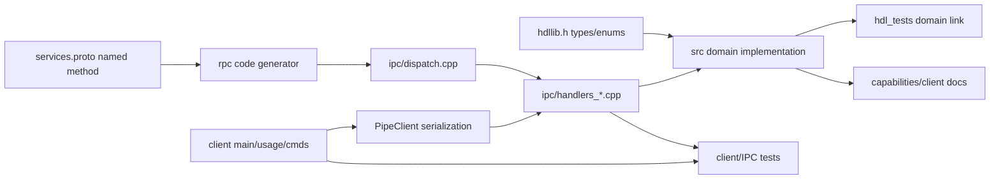

# Development and change guide

This guide turns common changes into bounded reading and validation sets. Use
[the agent index](README.md) to locate a feature and
[architecture.md](architecture.md) to understand cross-process behavior first.

## Build model

The root [`CMakeLists.txt`](../CMakeLists.txt) is authoritative.

| Option | Default | Effect |
|---|---:|---|
| `HDL_BUILD_TOOLS` | `ON` | Build `hdlclient.exe` |
| `HDL_BUILD_TESTS` | `ON` | Build local/API, selection, store, and live client tests |
| `HDL_BUILD_TOYS` | `ON` | Build `hdl_toy_arena.exe` and, with tools, `hdl_toy_tests.exe` |
| `HDL_DISASM_ZYDIS` | `ON` | Fetch and register Zydis |
| `HDL_DISASM_CAPSTONE` | `ON` | Fetch and register Capstone |
| `HDL_WARNINGS_AS_ERRORS` | `OFF` | Promote warnings on first-party targets; enabled by CI presets |
| `HDL_ENABLE_ASAN` | `OFF` | Instrument first-party targets with MSVC AddressSanitizer |
| `HDL_ENABLE_CLANG_TIDY` | `OFF` | Run the configured clang-tidy checks during C++ compilation |
| `HDL_ENABLE_MSVC_ANALYZE` | `OFF` | Run MSVC native code analysis during compilation |
| `HDL_BUILD_FUZZERS` | `OFF` | Build clang-cl/libFuzzer parser harnesses |
| `HDL_ENABLE_COVERAGE` | `OFF` | Enable clang source-based coverage instrumentation |

At least one disassembly backend must remain enabled. The project is Windows
x64 only and enables MASM for the call/hook shims.

Primary Visual Studio 2026 preset (the generator needs CMake 4.2; the supported
CI/developer tier uses CMake 4.4 or newer):

```bat
cmake --preset x64-windows-vs2026
cmake --build --preset x64-windows-vs2026 --config Release
ctest --test-dir build/x64-windows-vs2026 -C Release -R hdl_ --output-on-failure
```

Use `x64-windows-vs2022` only when reproducing the supported compatibility
toolchain.

Typical Ninja preset after entering an x64 MSVC environment:

```bat
cmake --preset x64-windows
cmake --build --preset x64-windows
ctest --test-dir build/x64-windows -R hdl_ --output-on-failure
```

The checked-in CI presets split desktop-independent tests from the live GUI and
injection suite. See [ci.md](ci.md) before running or changing CI: GUI-labeled
tests require an unlocked interactive Windows runner and must not execute
untrusted pull-request code on a persistent machine.

For repository quality gates, use only the wrapper (`./tools/ci/run-checks.ps1`,
`-Profile PR -Bootstrap`, `-Check <name>`, or `-Profile GUI`). Raw CMake commands
above are for exploratory developer builds, not CI parity.

## How a capability crosses the repository



The named pipe is the sole remote control channel. `api.cpp` only exports
`HdlHookProc` / `HdlWinEventProc` for inject techniques.

- Recipes and the interest store are intentionally client-only.
- Ping is IPC-only.
- Disasm custom backends are not remote; use built-in Enum/Get/Set.

## Add or change a pipe-backed operation

1. Define or update flags, structures, and enums in
   [`include/hdllib/hdllib.h`](../include/hdllib/hdllib.h) when wire types change.
2. Implement the operation in its domain `.cpp`/`.hpp`. Keep process mechanics
   out of adapters.
3. Declare the named RPC under the appropriate service in
   [`proto/hdl/rpc/v1/services.proto`](../proto/hdl/rpc/v1/services.proto).
   Method identity is generated from the schema; do not add a parallel numeric
   registry or handwritten dispatch entry.
4. Declare the handler in [`src/ipc/handlers.hpp`](../src/ipc/handlers.hpp) and
   implement it in the matching `handlers_*.cpp`. The generated dispatch include
   connects the schema method to the matching `Handle<Method>` function.
5. Update client serialization or add a `Cmd*` handler in the matching
   [`tools/client/cmds_*.cpp`](../tools/client/) file. Register human-facing
   commands in [`tools/client/main.cpp`](../tools/client/main.cpp) and document
   syntax in [`tools/client/usage.cpp`](../tools/client/usage.cpp).
6. Add domain coverage in `hdl_tests` (links `hdl_domain_obj`) and live
   pipe/client coverage in `hdl_client_tests`.
7. Update [capabilities.md](capabilities.md), and update
   [client.md](client.md) when users receive a command or workflow.
8. Recheck all size-query, streaming, cancellation, and cleanup paths.

### Handler family routing

| Operation family | Handler file | Client command file |
|---|---|---|
| Lifecycle, injection, memory basics, health, fingerprint | [`handlers_basic.cpp`](../src/ipc/handlers_basic.cpp) | [`cmds_basic.cpp`](../tools/client/cmds_basic.cpp), injection in [`local_inject.cpp`](../tools/client/local_inject.cpp) |
| Search sessions | [`handlers_search.cpp`](../src/ipc/handlers_search.cpp) | [`cmds_scan.cpp`](../tools/client/cmds_scan.cpp) |
| Calls, alloc, resolution | [`handlers_call.cpp`](../src/ipc/handlers_call.cpp) | [`cmds_call.cpp`](../tools/client/cmds_call.cpp) |
| Hooks | [`handlers_hooks.cpp`](../src/ipc/handlers_hooks.cpp) | [`cmds_hooks.cpp`](../tools/client/cmds_hooks.cpp) |
| Locate | [`handlers_locate.cpp`](../src/ipc/handlers_locate.cpp) | [`cmds_locate.cpp`](../tools/client/cmds_locate.cpp) |
| Discover | [`handlers_discover.cpp`](../src/ipc/handlers_discover.cpp) | [`cmds_discover.cpp`](../tools/client/cmds_discover.cpp) |
| Caves, nearby allocation, protection | [`handlers_place.cpp`](../src/ipc/handlers_place.cpp) | [`cmds_place.cpp`](../tools/client/cmds_place.cpp) |
| Disassembly, code, PE, graph, vtable, watch | [`handlers_code.cpp`](../src/ipc/handlers_code.cpp) | [`cmds_place.cpp`](../tools/client/cmds_place.cpp) |

## Add an injection technique

1. Add the public method enum/name mapping in
   [`include/hdllib/hdllib.h`](../include/hdllib/hdllib.h) and client parsing in
   [`tools/client/local_inject.cpp`](../tools/client/local_inject.cpp).
2. Declare the method in
   [`src/inject/techniques.hpp`](../src/inject/techniques.hpp).
3. Implement one focused file under [`src/inject/`](../src/inject/), reusing
   [`common.cpp`](../src/inject/common.cpp) primitives and RAII `RemoteAlloc`.
4. Add the file to `HDL_INJECT_SOURCES` in
   [`CMakeLists.txt`](../CMakeLists.txt).
5. Add dispatch in [`src/inject.cpp`](../src/inject.cpp).
6. Add a `MethodRequirement` catalog row and probe/score logic in
   [`src/inject/select.cpp`](../src/inject/select.cpp). Update
   `kMethodCount` in [`select.hpp`](../src/inject/select.hpp).
7. Add deterministic scoring tests in
   [`tests/test_select.cpp`](../tests/test_select.cpp) and an appropriate live
   target-profile expectation in [`tests/test_main.cpp`](../tests/test_main.cpp).
8. Add a per-method page and index it from
   [`docs/inject/README.md`](inject/README.md).

Classify each requirement as hard, soft, or unprobeable. Early Bird-style
spawn-only techniques must not enter PID auto-selection. Preserve the x64-only
guard and reject Wow64 targets.

## Add a client recipe or locator

Recipes compose existing operations and belong in
[`tools/client/recipes.cpp`](../tools/client/recipes.cpp). Persistent controller
state belongs in [`recipes.hpp`](../tools/client/recipes.hpp).

For a new locator type:

1. Extend the tagged `Locator` model in
   [`store.hpp`](../tools/client/store.hpp).
2. Update both load and save paths in
   [`store.cpp`](../tools/client/store.cpp), including old schema compatibility.
3. Update `RevalidateStore` and decide whether revalidation is read-only,
   allocates runtime state, or mutates the target.
4. Wire one-shot argv parsing and usage text for any new verbs/flags.
5. Add round-trip/migration coverage in
   [`tests/store_test.cpp`](../tests/store_test.cpp) and a live recipe case in
   client or toy tests.
6. Update [client.md](client.md#4-interest-store-and-recipes).

The store is durable intent. Avoid silently reapplying dangerous mutations
during ordinary revalidation; the existing patch locator resolves its target
without enabling the patch.

## Public API and wire conventions

### Fill-buffer pattern

Many C APIs use `out, inout_count`:

1. Call with `out == nullptr` or insufficient count.
2. The function writes the required count.
3. Allocate that many records and call again.

Return `HDL_E_BUFFER_SMALL` when the public contract specifies it. Handlers
often perform this two-pass call internally before serializing a vector.

### Status and validation

- Validate pointers, sizes, enum ranges, maximum counts, and overflow before
  touching target memory.
- Preserve `HdlStatus` meanings. Do not convert a missing session into a generic
  failure.
- Use SEH-safe memory helpers for untrusted in-process addresses.
- Keep wire fields fixed-width. Do not serialize `size_t`, raw STL objects, or
  pointers as protocol structure.

### Long operations

Long scans and graph/discover traversals should accept a cancel token or job,
call `JobCheck`/`TokenCheck` inside loops, and preserve
`HDL_E_CANCELLED`/`HDL_E_TIMEOUT`.

If a schema method supports streaming, keep both delivery modes:

- Non-streaming callers receive one ordinary response.
- Streaming callers receive ordered chunks with stable `total`, `offset`, and
  `count`; only intermediate chunks set `HDL_IPC_MORE`.

### Resource ownership

When adding process-local runtime state:

- Give it an explicit close/remove operation when useful.
- Add it to the correct shutdown path in [`core.cpp`](../src/core.cpp)
  (`BeginShutdown` / `CoreShutdownPrepare` + `CoreShutdownFinish`, or
  `CoreShutdownDetach` for loader-lock residual) or IPC server cleanup.
  Remote prepare is `Control/Shutdown`; do not rely on `DLL_PROCESS_DETACH` alone for
  MinHook / VEH / IPC join.
- Define whether handles survive enable/disable and whether removal restores
  target memory/protection.
- Make cleanup safe after partial initialization.

## Test selection

| Changed area | Minimum focused test | Broader validation |
|---|---|---|
| Pure injection scoring/catalog | `hdl_select_tests` | `hdl_tests --inject-only` |
| Injection technique/common helpers | Relevant injection profile in `hdl_tests --inject-only` | Full `hdl_tests` |
| Public in-target API or shared primitive | `hdl_tests --api-only` | Full `hdl_tests` |
| Locate/discover internals | `hdl_tests --locate-only` | `hdl_toy_tests` |
| IPC framing/handler/client command | Relevant `hdl_client_tests` path | `hdl_tests` + `hdl_client_tests` |
| Store schema/parser | `hdl_store_tests` | `hdl_client_tests` |
| Recipe or high-level workflow | Focused client case | `hdl_toy_tests` |
| Toy ground-truth behavior | `hdl_toy_tests` | Full CTest set |
| Build graph/options | Configure both applicable presets | Full CTest set |
| Documentation only | Link and Mermaid validation | No binary rebuild normally required |

Test binary roles and target profiles are documented in
[`tests/README.md`](../tests/README.md).

### Test ownership map

| Test source | What it protects |
|---|---|
| [`tests/test_select.cpp`](../tests/test_select.cpp) | Pure target-profile scoring, hard/soft gates, stealth preference, Wow64 rejection |
| [`tests/test_main.cpp`](../tests/test_main.cpp) | Local exported API, place/code/watch/graph, locate/discover fixtures, live injection matrix |
| [`tests/client_test_main.cpp`](../tests/client_test_main.cpp) | End-to-end executable commands, framing, one-shot store/recipes against a target |
| [`tests/store_test.cpp`](../tests/store_test.cpp) | Interest JSON v1/v2 migration and v3 round trips |
| [`tests/toy_test_main.cpp`](../tests/toy_test_main.cpp) | Higher-level locate/discover/path/heat/vcall/watch/place/stitch workflows |
| [`tests/target/main.cpp`](../tests/target/main.cpp) | Configurable injection victim and exported ground truth |
| [`toys/arena/main.cpp`](../toys/arena/main.cpp) | Deterministic object graph and behavior for reverse-engineering workflows |

## High-risk change sets

Read these files together before editing:

| Change | Required context set |
|---|---|
| RPC method or payload | `services.proto`, generated RPC metadata, `dispatch.cpp`, matching handler, client serializer, `rpc.md`, `capabilities.md`, live tests |
| Search semantics | `hdllib.h` search enums/structs, `memory.cpp`, `handlers_search.cpp`, `cmds_scan.cpp`, discover scan composition, local/client tests |
| Address filtering or memory safety | `memory.cpp`, `resolve.cpp`, `locate.cpp`, `place.cpp`, `graph.cpp`, `discover.cpp` |
| Function-boundary/disassembly logic | `disasm/`, `code.cpp`, `graph.cpp`, discover ranking/synthesis, both backend configurations |
| Hook-hit layout or capture assembly | `hdllib.h`, `hooks_trace.asm`, `hooks.cpp`, discover action ranking, hook handlers/client/tests |
| Watch/event behavior | `watch.cpp`, `health.cpp`, discover region/apply-watch paths, handler/client polling, teardown order |
| Session ownership | `memory.cpp` or `discover.cpp`, `ipc/common.cpp`, relevant handlers, `ipc/server.cpp`, `core.cpp` |
| Interest JSON | `store.hpp`, all parsing/writing in `store.cpp`, recipes/revalidation, store migrations and controller tests |

## Documentation maintenance

When behavior changes:

- Update [rpc.md](rpc.md) and [capabilities.md](capabilities.md) for schema, ABI,
  or wire details.
- Update [client.md](client.md) for commands, workflows, recipes, or store schema.
- Update the injection technique page and index for injection changes.
- Update this index when ownership or file routing changes.
- Prefer links to authoritative files over copying large declarations.
- Keep Mermaid diagrams structural. Exact flags, record layouts, and numeric
  values belong in tables or the capability reference.
