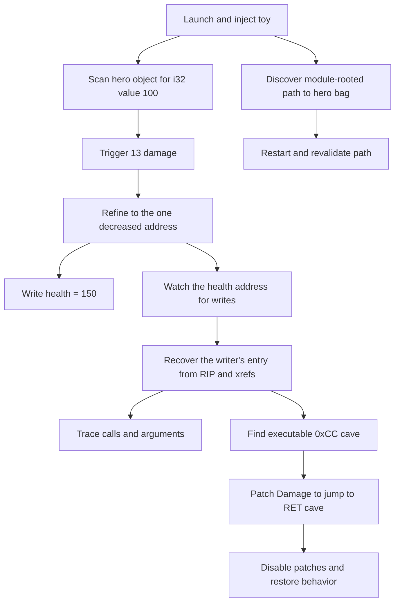
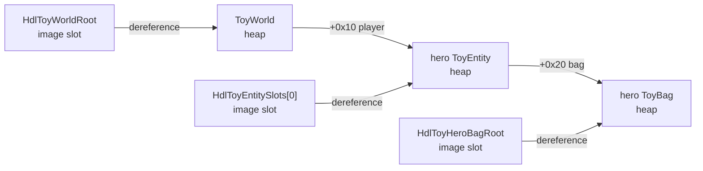
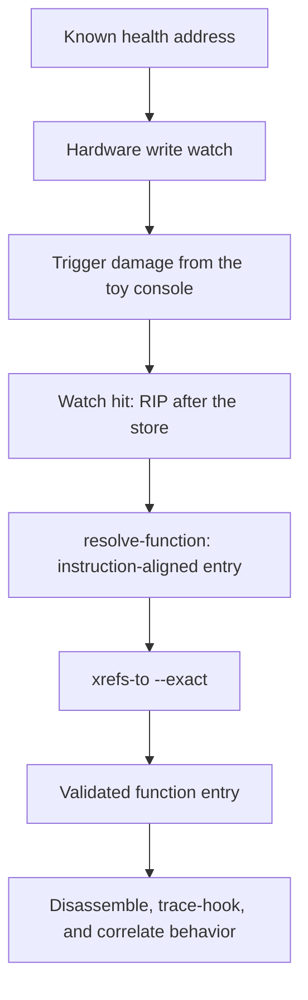
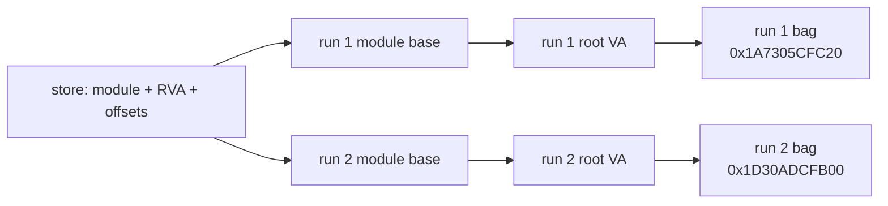

# Toy arena: an end-to-end HDLLib walkthrough

This lab follows one concrete investigation from a changing integer to a
restart-safe pointer, a function, live hook evidence, executable code caves,
and a reversible control-flow detour.

It uses only `hdl_toy_arena.exe`, a target built specifically for HDLLib. The
addresses in captured output below came from one Release build and will differ
after rebuilding, rebooting, or relaunching. Always substitute addresses from
your own output.

## What the lab proves

By the end, you will have:

1. narrowed two identical `100` values to the hero's changing health field;
2. changed health directly and observed the target reflect the change;
3. located the unknown function that writes health, without resolving a function export;
4. correlated its instructions, xrefs, hook arguments, and object offset;
5. installed a trace hook and enabled/disabled it;
6. discovered a module-relative pointer path to a heap object;
7. saved that path, restarted the target, and resolved the new heap address;
8. found executable `0xCC` code caves near the function;
9. redirected damage through a cave so damage became a no-op;
10. disabled the detour and proved the original behavior was restored.



## The controlled target

The relevant toy layouts are fixed in
[`toys/arena/main.cpp`](../toys/arena/main.cpp):

| Object | Offset | Field | Initial hero value |
|---|---:|---|---:|
| `ToyEntity` | `+0x00` | vtable | pointer |
| `ToyEntity` | `+0x08` | `health` | `100` |
| `ToyEntity` | `+0x0C` | `max_health` | `100` |
| `ToyEntity` | `+0x10` | `x` | `0.0` |
| `ToyEntity` | `+0x14` | `y` | `0.0` |
| `ToyEntity` | `+0x18` | `target` | entity pointer |
| `ToyEntity` | `+0x20` | `bag` | `ToyBag*` |
| `ToyEntity` | `+0x28` | `name[16]` | `"hero"` |
| `ToyBag` | `+0x00` | magic | `TOYBAG01` |
| `ToyBag` | `+0x08` | gold | `50` |
| `ToyBag` | `+0x0C` | potions | `1` |

The exported image slots are deliberate test oracles:



The named getters and data exports are shortcuts for bounding and checking the
value and pointer exercises. In an unknown target, those oracles would be
replaced by a wider scan, a behavioral anchor, an import, or a previously
verified locator. The function-discovery, hook, and detour steps deliberately
do not resolve or invoke either exported damage function.

## 0. Build and verify

From the repository root:

```powershell
cmake --preset x64-windows-vs
cmake --build --preset x64-windows-vs
.\build\x64-windows-vs\Release\hdl_toy_tests.exe
```

The walkthrough was last verified with:

```text
Summary: 97 passed, 0 failed, 0 soft
```

The test executable runs the same core operations non-interactively. The
remaining sections make their evidence visible and add the reversible
cave-backed detour.

## 1. Launch and inject

Use two PowerShell terminals. In **Terminal A**:

```powershell
cd .\build\x64-windows-vs\Release
.\hdl_toy_arena.exe --entities 4
```

Do not pass `--auto`; background ticks make scan refinement harder to explain.
The toy prints a PID and an initial state:

```text
hdl_toy_arena pid=48400 entities=4 auto_ms=0
...
  [0] hero     hp=100/100 ... self=000001A7305DAE10 ... bag=000001A7305CFC20 gold=50
```

The status line is ground truth. Do not use its addresses as inputs unless a
step explicitly says to compare against them.

In **Terminal B**, enter the same Release directory and set the PID printed by
your toy:

```powershell
cd .\build\x64-windows-vs\Release
$ToyPid = 48400
$Client = ".\hdlclient.exe"
$Dll = (Resolve-Path ".\hdllib.dll").Path

& $Client inject $ToyPid $Dll
& $Client $ToyPid ping
& $Client $ToyPid modbase --module hdl_toy_arena.exe
```

The remaining commands use this helper to print an `hdlclient` response and
capture one hexadecimal field from it:

```powershell
function Invoke-HdlHex {
    param(
        [Parameter(Mandatory)] [object[]] $Arguments,
        [Parameter(Mandatory)] [string] $Field
    )

    $text = (& $Client @Arguments 2>&1 | Out-String).Trim()
    if ($LASTEXITCODE -ne 0) {
        throw "hdlclient failed: $text"
    }
    Write-Host $text

    $match = [regex]::Match(
        $text,
        [regex]::Escape($Field) + "([0-9a-fA-F]+)"
    )
    if (-not $match.Success) {
        throw "Missing field $Field"
    }
    [Convert]::ToUInt64($match.Groups[1].Value, 16)
}
```

Representative output:

```text
Injected into pid 48400.
Pipe: \\.\pipe\RPCControl_D5D949DC
Module base: 0x7FFCDC3D0000
status=OK remote_pid=48400
status=OK base=00007ff652b70000
```

There are two different bases here:

- the injection command reports the base of `hdllib.dll`;
- `modbase --module hdl_toy_arena.exe` reports the toy image base.

The latter is the base used for module-relative locators.

## 2. Locate the changing health value

### 2.1 Bound the first scan

Use the toy's getter to obtain the hero object. This deliberately bounds the
exercise to a 56-byte object so the two initial matches are easy to interpret:

```powershell
$Hero = Invoke-HdlHex `
    -Arguments @($ToyPid, "call", "HdlToyGetEntity", "u64:0") `
    -Field "return="
```

Example:

```text
status=OK return=000001a7305dae10 last_error=0
```

```powershell
$HeroHex = "0x{0:x}" -f $Hero
```

Start an aligned 32-bit integer scan over exactly `sizeof(ToyEntity)`, which is
`0x38` bytes:

```powershell
& $Client $ToyPid scan --type i32 --value 100 `
    --start $HeroHex --size 0x38 --max 16
```

Expected shape:

```text
status=OK hits=2 session=1
status=OK total=2 showing=2 session=1
  000001a7305dae18
  000001a7305dae1c
```

At this point both hits are valid hypotheses. They are eight and twelve bytes
after the object base, but pretend the layout is not yet known.

Save the session ID:

```powershell
$ScanSession = 1
```

### 2.2 Trigger one controlled change

In Terminal A, trigger the behavior through the toy's normal user-facing
command:

```text
damage 0 13
```

The toy prints a new status line with hero health `87`. At this point, assume
you know only the action you performed and the candidate addresses—not the
name or address of any function behind the command.

Refine against the previous snapshot:

```powershell
& $Client $ToyPid scan --next --session $ScanSession `
    --cmp decreased --max 16
```

Captured result:

```text
status=OK hits=1 session=1
status=OK total=1 showing=1 session=1
  000001a7305dae18
```

Optionally prove the new value is exactly `87`:

```powershell
& $Client $ToyPid scan --next --session $ScanSession `
    --cmp exact --type i32 --value 87 --max 16
```

The surviving address is health:

```powershell
$Health = 0x000001A7305DAE18
$HealthHex = "0x{0:x}" -f $Health
& $Client $ToyPid read $HealthHex 4
```

```text
status=OK bytes=4
57 00 00 00
```

`0x57` is decimal `87`, and `$Health - $Hero` is `8`. The scan has therefore
recovered the `health` offset without reading the source layout.

### 2.3 Modify the value

Write decimal `150`, encoded as little-endian `0x00000096`:

```powershell
& $Client $ToyPid write $HealthHex "96 00 00 00"
& $Client $ToyPid read $HealthHex 4
```

```text
status=OK wrote=4
status=OK bytes=4
96 00 00 00
```

Type `status` in Terminal A. It now reports `hp=150/100`. That impossible
above-maximum state is useful proof that the write, rather than normal toy
behavior, controlled the value.

Keep health at `150` for the hook experiment.

## 3. Locate the unknown function that writes health

Do not resolve `HdlToyDamage` or `HdlToyCallDamage`, and do not invoke either
through `hdlclient call`. Treat the console command as a black-box action. The
bridge from known data to unknown code is a hardware write watchpoint.



### 3.1 Catch the instruction that changes health

Install a four-byte write watch on the address recovered by the scan:

```powershell
$WatchText = (
    & $Client $ToyPid watch hw $HealthHex `
        --size 4 --access write 2>&1 |
    Out-String
).Trim()
Write-Host $WatchText

$WatchMatch = [regex]::Match($WatchText, "handle=(\d+)")
if (-not $WatchMatch.Success) {
    throw "No hardware-watch handle"
}
$HealthWatch = [uint64]$WatchMatch.Groups[1].Value
```

```text
status=OK handle=1
```

In Terminal A, run the same behavior with a different, recognizable amount:

```text
damage 0 7
```

Use the console here, not a one-shot `hdlclient call`. A hardware watch is
applied to threads that exist when it is installed; the toy's console thread
already exists, while a later IPC request may execute on a new thread. If the
target created relevant threads after installation, run `watch refresh` before
triggering the action.

Poll the event queue in Terminal B:

```powershell
$WatchHits = (
    & $Client $ToyPid watch hits --timeout 500 --max 8 2>&1 |
    Out-String
).Trim()
Write-Host $WatchHits

$RipMatch = [regex]::Match($WatchHits, "rip=([0-9a-fA-F]+)")
if (-not $RipMatch.Success) {
    throw "The action produced no write hit"
}
$WriteRip = [Convert]::ToUInt64($RipMatch.Groups[1].Value, 16)
$WriteRipHex = "0x{0:x}" -f $WriteRip
```

Captured output:

```text
status=OK count=1
  handle=1 rip=00007ff652b71d09 accessed=000001a7305dae18 size=4 tid=49568
```

The reported RIP is the instruction after the faulting store on x86-64. It is
an address inside the unknown writer, not necessarily its entry.

### 3.2 Resolve the instruction-aligned function entry

Pass the arbitrary interior RIP directly to HDLLib:

```powershell
$Damage = Invoke-HdlHex `
    -Arguments @(
        $ToyPid, "resolve-function", $WriteRipHex,
        "--module", "hdl_toy_arena.exe"
    ) `
    -Field "start="
$DamageHex = "0x{0:x}" -f $Damage
```

Captured output:

```text
status=OK
  start=00007ff652b71cc0 end=00007ff652b71d25 conf=100 flags=3
```

No manual byte decrement or candidate alignment is required. On x64 image
code, `resolve-function` first asks the platform's unwind table for the
compiler-authored function range containing the supplied byte address. The
input may be any byte inside that range, including the post-store RIP reported
by a hardware watch. If unwind metadata is unavailable, HDLLib falls back to
its bounded index of call targets and narrowly matched prologues; conditional
and local jump targets are not treated as function entries.

Confirm that executable code contains a direct caller of the aligned entry:

```powershell
& $Client $ToyPid xrefs-to $DamageHex `
    --module hdl_toy_arena.exe --max 16 --exact
```

```text
status=OK count=1
  00007ff652b71cb4 -> 00007ff652b71cc0 kind=1
```

The procedure used only the watched data address, behavioral input, unwind
metadata, executable bytes, and control-flow xrefs. It did not use a function
name or export address and would take the same path if the damage functions
were absent from the export table.

### 3.3 Use the disassembler to validate and learn

List the compiled-in backends, inspect the selected one, and decode far enough
to include the watched store:

```powershell
& $Client $ToyPid disasm-backend list
& $Client $ToyPid disasm-backend get
& $Client $ToyPid disasm $DamageHex --max 24
```

The verified build selected backend `1`, Zydis. Its relevant instructions were:

```text
00007ff652b71cc0  mov      [rsp+0x10], edx
00007ff652b71cc4  mov      [rsp+0x08], ecx
00007ff652b71cc8  sub      rsp, 0x38
00007ff652b71ccc  mov      ecx, [rsp+0x40]
00007ff652b71cd0  call     0x00007FF652B71D60
00007ff652b71cd5  mov      [rsp+0x20], rax
00007ff652b71cda  cmp      qword ptr [rsp+0x20], 0x00
00007ff652b71ce0  jnz      0x00007FF652B71CE4
00007ff652b71ce2  jmp      0x00007FF652B71D20
00007ff652b71ce4  cmp      dword ptr [rsp+0x48], 0x00
00007ff652b71ce9  jnl      0x00007FF652B71CF3
00007ff652b71ceb  mov      dword ptr [rsp+0x48], 0x00
00007ff652b71cf3  mov      rax, [rsp+0x20]
00007ff652b71cf8  mov      ecx, [rsp+0x48]
00007ff652b71cfc  mov      eax, [rax+0x08]
00007ff652b71cff  sub      eax, ecx
00007ff652b71d01  mov      rcx, [rsp+0x20]
00007ff652b71d06  mov      [rcx+0x08], eax
00007ff652b71d09  mov      rax, [rsp+0x20]
00007ff652b71d0e  cmp      dword ptr [rax+0x08], 0x00
00007ff652b71d12  jnl      0x00007FF652B71D20
00007ff652b71d14  mov      rax, [rsp+0x20]
00007ff652b71d19  mov      dword ptr [rax+0x08], 0x00
00007ff652b71d20  add      rsp, 0x38
```

This supplies useful facts without source or symbols:

- Windows x64 passes the first two integer arguments in `ECX` and `EDX`, and
  the entry spills both;
- the first argument is forwarded to a helper that returns an object in `RAX`;
- negative values of the second argument are changed to zero;
- the routine reads a 32-bit field at object offset `+0x08`, subtracts the
  second argument, and writes the result back at `...1D06`;
- the watch RIP `...1D09` is exactly the instruction after that write;
- the following comparison and store clamp the field to zero.

The dataflow therefore identifies this as the damage routine and independently
confirms the scan result: health is an `i32` at entity offset `+0x08`.

Remove the watch before installing an inline hook, then restore the simple
`150` baseline used below:

```powershell
& $Client $ToyPid watch unwatch $HealthWatch
& $Client $ToyPid write $HealthHex "96 00 00 00"
```

## 4. Hook the function and observe live arguments

Install a pass-through trace hook with two captured arguments:

```powershell
$HookText = & $Client $ToyPid hooktrace $DamageHex --args 2
$HookText
```

```text
status=OK handle=00007ff652b71cc0
```

For a trace hook, the handle is the hooked target address:

```powershell
$Hook = $Damage
$HookHex = $DamageHex
```

In Terminal A, trigger the same black-box action:

```text
damage 0 5
```

Then read the value and trace queue in Terminal B:

```powershell
& $Client $ToyPid read $HealthHex 4
& $Client $ToyPid hookhits --timeout 500 --max 8
```

Captured output:

```text
status=OK bytes=4
91 00 00 00
status=OK count=1
  hook=00007ff652b71cc0 ret=000001a7305dae10 caller=00007ff652b71cb9 args=2 a0=0 a1=5
```

The evidence agrees in four ways:

- health changed from `150` to `145` (`0x91`);
- `a0=0` is the hero index;
- `a1=5` is the damage amount;
- the caller is five bytes after the call xref at `...1CB4`.

The `ret=` field is not meaningful because the hooked function returns `void`.

Now disable only the instrumentation:

```powershell
& $Client $ToyPid hook-enable $HookHex 0
```

Type `damage 0 3` in Terminal A, then poll from Terminal B:

```powershell
& $Client $ToyPid read $HealthHex 4
& $Client $ToyPid hookhits --timeout 0 --max 8
```

Expected:

```text
status=OK bytes=4
8E 00 00 00
status=OK count=0
```

Health still changed from `145` to `142`; disabling a trace hook disables
observation, not the original function.

Re-enable it and prove events resume:

```powershell
& $Client $ToyPid hook-enable $HookHex 1
```

Type `damage 0 2` in Terminal A, then finish in Terminal B:

```powershell
& $Client $ToyPid read $HealthHex 4
& $Client $ToyPid hookhits --timeout 500 --max 8
& $Client $ToyPid unhook $HookHex
```

The verified run produced health `140` (`8C 00 00 00`) and a new hook hit with
`a1=2`.

## 5. Discover a pointer that survives restart

Health belongs to a `ToyEntity`. For the persistence example, use its
dynamically allocated `ToyBag`, because a new process gives it a new heap
address.

### 5.1 Obtain a target, then rediscover its root

The known multilevel path is:

```text
address of HdlToyWorldRoot
    dereference, add +0x10  -> address of ToyWorld::player
    dereference, add +0x20  -> address of ToyEntity::bag
    dereference, add +0x00  -> ToyBag
```

Resolve and follow it:

```powershell
$WorldRoot = Invoke-HdlHex `
    -Arguments @($ToyPid, "resolve", "HdlToyWorldRoot") `
    -Field "addr="
$WorldRootHex = "0x{0:x}" -f $WorldRoot
$Bag = Invoke-HdlHex `
    -Arguments @($ToyPid, "ptrchain", $WorldRootHex, "+16", "+32", "+0") `
    -Field "addr="
$BagHex = "0x{0:x}" -f $Bag
```

Now ask pointer scanning to find image-resident roots that reach that heap
object:

```powershell
$Store = Join-Path $PWD "toy-interests.json"
$ReplInput = @"
ptrscan $BagHex --depth 2 --module hdl_toy_arena.exe --max 64
store add hero_bag --kind object path
store save
store list
quit
"@
$ReplInput | & $Client --store $Store $ToyPid repl
```

Captured result:

```text
status=OK count=2
  base=00007ff652b77118 depth=1 offs=0x0
  base=00007ff652b749f8 depth=2 offs=0xf0,0x0
store add ok
store saved
  hero_bag kind=object locators=1
```

`ptrscan` found two paths. The first is the direct
`HdlToyHeroBagRoot +0` path; the second reaches the bag through another
image-rooted relationship. In the REPL, `store add ... path` remembers the
first pointer-scan result, so inspect the ordering before saving.

The saved file is the important part:

```json
{
  "version": 3,
  "module": "",
  "interests": [
    {
      "name": "hero_bag",
      "kind": "object",
      "tag": "",
      "locators": [
        {
          "type": "path",
          "static_rva": "0x7118",
          "module": "hdl_toy_arena.exe",
          "offsets": "0",
          "last_addr": "0x0",
          "last_ok": 0
        }
      ]
    }
  ]
}
```

It does **not** persist `0x00007ff652b77118`. It persists:

```text
current base of hdl_toy_arena.exe + RVA 0x7118
    dereference + offset 0
    = current ToyBag address
```

That is what makes the root ASLR-safe.

### 5.2 Restart and revalidate

In Terminal A, type:

```text
quit
```

Launch the toy again:

```powershell
.\hdl_toy_arena.exe --entities 4
```

In Terminal B, replace `$ToyPid` with the new PID and inject again:

```powershell
$ToyPid = 49124 # Replace with the new PID printed in Terminal A.
& $Client inject $ToyPid $Dll
& $Client $ToyPid modbase --module hdl_toy_arena.exe
$ExpectedBag = Invoke-HdlHex `
    -Arguments @($ToyPid, "call", "HdlToyGetBag", "u64:0") `
    -Field "return="
$ExpectedBagHex = "0x{0:x}" -f $ExpectedBag
```

Load and revalidate the store in one short REPL run:

```powershell
$RevalidateInput = @"
store revalidate
store list
quit
"@
$RevalidateInput | & $Client --store $Store $ToyPid repl
```

Captured second-run result:

```text
[OK] hero_bag path -> 000001d30adcfb00
revalidate ok=1
  hero_bag kind=object locators=1
```

The first run's bag was `0x000001A7305CFC20`; the second run's was
`0x000001D30ADCFB00`. Revalidation followed the module-relative root to the new
heap allocation. The revalidated address should equal `$ExpectedBagHex`.

In the captured run, Windows reused the toy's image base
`0x00007FF652B70000` for both launches. Windows is allowed to do that during
one boot. The locator is still ASLR-safe because it stores module identity plus
RVA, looks up the current module base on every revalidation, and never stores
the absolute root address. A launch with a different image base uses the same
`0x7118` RVA.



## 6. Identify nearby code caves

Return to a fresh toy launch if you restarted at the end of the preceding
section. Rebuild the process-specific address ledger; never reuse the previous
process's absolute `$Hero`, `$Health`, `$Damage`, or `$Cave`.

```powershell
$Hero = Invoke-HdlHex `
    -Arguments @($ToyPid, "call", "HdlToyGetEntity", "u64:0") `
    -Field "return="
$Health = $Hero + 8
$HealthHex = "0x{0:x}" -f $Health
```

Now repeat [Catch the instruction that changes
health](#31-catch-the-instruction-that-changes-health) and [Resolve the
instruction-aligned function entry](#32-resolve-the-instruction-aligned-function-entry)
against this process. Use `damage 0 1` as the Terminal A trigger. The repeated
watchpoint and aligned resolution produce fresh `$Damage` and `$DamageHex`
values.
Do not replace this rediscovery with `resolve HdlToyDamage`; the old absolute
address is stale, and the point is to recover the unknown routine again under
the current layout.

Remove the second-run hardware watch before continuing:

```powershell
& $Client $ToyPid watch unwatch $HealthWatch
```

Search only executable image regions in the toy module. The default fill byte
is `0xCC`:

```powershell
$CavesText = (
    & $Client $ToyPid caves --near $DamageHex --min 16 `
        --image --executable --module hdl_toy_arena.exe 2>&1 |
    Out-String
).Trim()
Write-Host $CavesText
```

Captured output:

```text
status=OK count=2
  00007ff652b71920 size=16 region=00007ff652b71000
  00007ff652b73a62 size=20 region=00007ff652b71000
```

These are candidates, not automatically safe extension points. They satisfy
the mechanical query—at least 16 consecutive `0xCC` bytes in executable image
memory near damage—but a real target still requires ownership and reachability
analysis.

For this controlled toy, select the first result:

```powershell
$CaveMatch = [regex]::Match(
    $CavesText,
    "(?m)^\s+([0-9a-fA-F]{16})\s+size="
)
if (-not $CaveMatch.Success) {
    throw "No suitable code cave"
}
$Cave = [Convert]::ToUInt64($CaveMatch.Groups[1].Value, 16)
$CaveHex = "0x{0:x}" -f $Cave
```

If your build returns no cave, use `alloc-near` for the placement exercise
instead. Do not copy the sample cave address.

## 7. Demonstrate control with a reversible cave-backed detour

This final phase is intentionally toy-only. It converts the selected cave into
a one-byte `RET` function, then patches the recovered damage entry to jump
there. With the detour enabled, the unknown routine returns immediately. With
it disabled, the original bytes and behavior return.

### 7.1 Verify the overwrite boundary

The absolute jump emitted below is 12 bytes. Confirm that 12 bytes at the
function start cover complete instructions:

```powershell
& $Client $ToyPid disasm $DamageHex --max 4
& $Client $ToyPid instrlen $DamageHex
```

The verified build starts with three four-byte instructions:

```text
00007ff652b71cc0  mov      [rsp+0x10], edx
00007ff652b71cc4  mov      [rsp+0x08], ecx
00007ff652b71cc8  sub      rsp, 0x38
...
status=OK len=4
```

Therefore the 12-byte detour does not split an instruction in this build.
Recheck after every rebuild.

### 7.2 Put `RET` in the cave under the patch ledger

Create and enable a one-byte patch at the cave:

```powershell
$CavePatchText = (
    & $Client $ToyPid patch create $CaveHex "C3" `
        --name toy_ret_cave 2>&1 |
    Out-String
).Trim()
Write-Host $CavePatchText
$CavePatch = [uint64](
    [regex]::Match($CavePatchText, "handle=(\d+)").Groups[1].Value
)
& $Client $ToyPid patch enable $CavePatch
```

Using the patch ledger instead of a raw write preserves the original `0xCC`
byte for cleanup.

### 7.3 Generate the jump bytes

Ask HDLLib to encode, but not allocate, a `mov rax, cave; jmp rax` stub:

```powershell
$StubText = (
    & $Client $ToyPid stub --kind mov_rax_jmp `
        --target $CaveHex --no-alloc 2>&1 |
    Out-String
).Trim()
Write-Host $StubText
```

Captured output:

```text
status=OK stub_va=0000000000000000 stolen=0 size=12
48 b8 20 19 b7 52 f6 7f 00 00 ff e0
```

The eight bytes after `48 B8` are your cave address in little-endian order.
Capture the emitted byte line from your output:

```powershell
$JumpBytes = ($StubText -split "`r?`n" | Select-Object -Last 1).Trim()
```

### 7.4 Redirect damage and prove behavior changed

Create and enable the function-entry patch:

```powershell
$DamagePatchText = (
    & $Client $ToyPid patch create $DamageHex $JumpBytes `
        --name damage_to_ret_cave 2>&1 |
    Out-String
).Trim()
Write-Host $DamagePatchText
$DamagePatch = [uint64](
    [regex]::Match($DamagePatchText, "handle=(\d+)").Groups[1].Value
)
& $Client $ToyPid patch enable $DamagePatch
& $Client $ToyPid patch list
```

```text
status=OK count=2
  handle=1 addr=00007ff652b71920 en=1 name=toy_ret_cave
  handle=2 addr=00007ff652b71cc0 en=1 name=damage_to_ret_cave
```

Set health to a simple baseline in Terminal B:

```powershell
& $Client $ToyPid write $HealthHex "64 00 00 00"
```

Type `damage 0 7` in Terminal A, then read health in Terminal B:

```powershell
& $Client $ToyPid read $HealthHex 4
```

With the detour enabled:

```text
status=OK bytes=4
64 00 00 00
```

Health remained `100`: the normal console path reached the recovered entry,
the entry jumped to the cave, and the cave returned immediately.

Disable only the damage detour and repeat:

```powershell
& $Client $ToyPid patch disable $DamagePatch
```

Type `damage 0 7` in Terminal A again, then read health in Terminal B:

```powershell
& $Client $ToyPid read $HealthHex 4
```

```text
status=OK bytes=4
5D 00 00 00
```

`0x5D` is `93`. Disabling the ledger entry restored the original function
bytes and behavior.

### 7.5 Clean up in dependency order

The function must stop jumping to the cave before the cave is restored:

```powershell
& $Client $ToyPid patch disable $DamagePatch
& $Client $ToyPid patch remove $DamagePatch
& $Client $ToyPid patch disable $CavePatch
& $Client $ToyPid patch remove $CavePatch
& $Client $ToyPid patch list
```

Expected final state:

```text
status=OK count=0
```

This phase used the patch ledger rather than `recipe stitch` because the
desired semantics were specific: jump to a `RET` cave and suppress damage.
`recipe stitch` builds a stolen-instruction trampoline and enables its patch
immediately; it is not the same experiment.

## 8. End the lab

Close the scan session if the original process is still running:

```powershell
& $Client $ToyPid scan --close --session $ScanSession
```

Also ensure:

- the trace hook was removed with `unhook`;
- `patch list` is empty;
- any temporary `alloc-near` allocation was freed;
- `toy-interests.json` is kept only if you want to inspect or reuse it.

Type `quit` in Terminal A. Exiting the toy also removes the injected DLL,
heap objects, hooks, and process-local allocations.

## Evidence chain

The walkthrough is deliberately redundant. Each conclusion is supported by
more than one observation:

| Conclusion | Evidence |
|---|---|
| `hero+8` is health | decreased scan hit, direct read/write, Terminal A status, disassembly `[rax+0x08]` |
| `...1CC0` is the damage entry | health write watch, instruction-aligned resolution, direct-call xref, disassembled read/subtract/write, live hook |
| second damage argument is amount | console input, hook `a1`, disassembly subtraction |
| normal command path calls the recovered entry | `xrefs-to`, hook caller return address, matching behavioral change |
| bag locator is restart-safe | module + RVA JSON, changed heap address, successful revalidation |
| cave detour controlled behavior | patch list, unchanged health while enabled, decreased health after disable |
| cleanup restored original state | disabled ledger entries, original behavior, empty patch list |

## Troubleshooting

| Symptom | Likely cause and correction |
|---|---|
| `ping` cannot connect | Injection failed, the PID is stale, or the toy exited. Re-read Terminal A's PID and inject again. |
| Initial scan does not return two hits | `$Hero` came from an older process, health is no longer `100`, or `--size` is not `0x38`. Restart the toy. |
| Health watch returns `count=0` | Trigger `damage` in Terminal A so the write occurs on the already-watched console thread. If relevant threads were created after installation, run `watch refresh` and retry. |
| `resolve-function` returns an internal block | The injected DLL is older than the client or target. Rebuild HDLLib, reinject it, and retry; current x64 builds prefer compiler-authored unwind ranges before heuristic fallback. |
| `store add ... path` saves an unexpected path | It stores the first REPL pointer-scan result. Inspect the printed order; any saved path must have an image root in `hdl_toy_arena.exe`. |
| Bag address does not change after `bag 0` | The heap allocator may reuse an address. A full process restart is stronger; validate the path and object contents, not inequality alone. |
| Module base is identical after restart | Windows may reuse an ASLR base during one boot. Inspect the store: module + RVA, not an absolute root, is the ASLR-safe property. |
| No cave is returned | Compiler/linker output changed. Use `alloc-near`, or rebuild the verified configuration; never reuse the sample cave address. |
| `hooktrace` returns `E_BUSY` | A hook already exists at that function. Remove the previous handle before reinstalling. |
| Detour patch size is not 12 bytes | You selected a different stub kind. Re-run `stub --kind mov_rax_jmp --no-alloc` and recheck instruction boundaries. |
| Target faults after patch enable | Disable the function patch first. Re-resolve all addresses for the current PID and verify the cave contains `C3`. |

## Source and test trail

- toy object graph and behavior:
  [`toys/arena/main.cpp`](../toys/arena/main.cpp)
- assertion-backed automated sequence:
  [`tests/toy_test_main.cpp`](../tests/toy_test_main.cpp)
- scan sessions: [`src/memory.cpp`](../src/memory.cpp) and
  [`tools/client/cmds_scan.cpp`](../tools/client/cmds_scan.cpp)
- pointer scan and pointer following:
  [`src/locate.cpp`](../src/locate.cpp),
  [`src/resolve.cpp`](../src/resolve.cpp), and
  [`tools/client/cmds_locate.cpp`](../tools/client/cmds_locate.cpp)
- interest-store path persistence:
  [`tools/client/store.cpp`](../tools/client/store.cpp),
  [`tools/client/repl.cpp`](../tools/client/repl.cpp), and
  [`tools/client/recipes.cpp`](../tools/client/recipes.cpp)
- disassembly and xrefs:
  [`src/disasm/`](../src/disasm/), [`src/graph.cpp`](../src/graph.cpp), and
  [`tools/client/cmds_place.cpp`](../tools/client/cmds_place.cpp)
- hardware write watches: [`src/watch.cpp`](../src/watch.cpp) and
  [`tools/client/cmds_place.cpp`](../tools/client/cmds_place.cpp)
- trace hooks: [`src/hooks.cpp`](../src/hooks.cpp) and
  [`tools/client/cmds_hooks.cpp`](../tools/client/cmds_hooks.cpp)
- caves, stubs, and reversible patches:
  [`src/place.cpp`](../src/place.cpp), [`src/code.cpp`](../src/code.cpp), and
  [`tools/client/cmds_place.cpp`](../tools/client/cmds_place.cpp)
