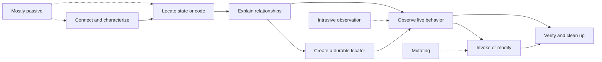
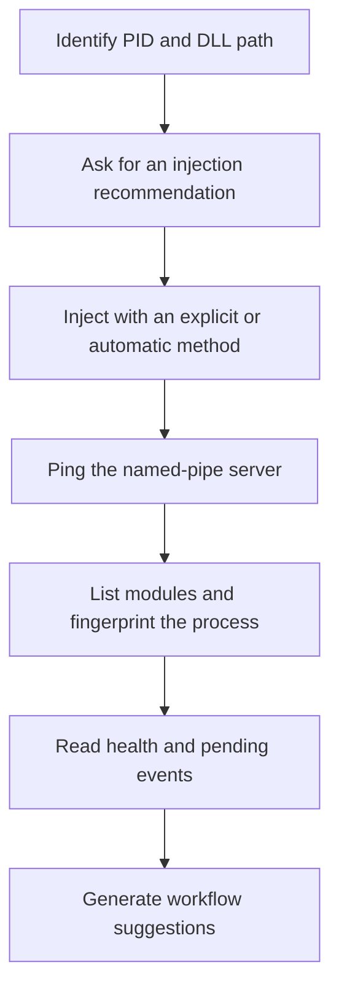
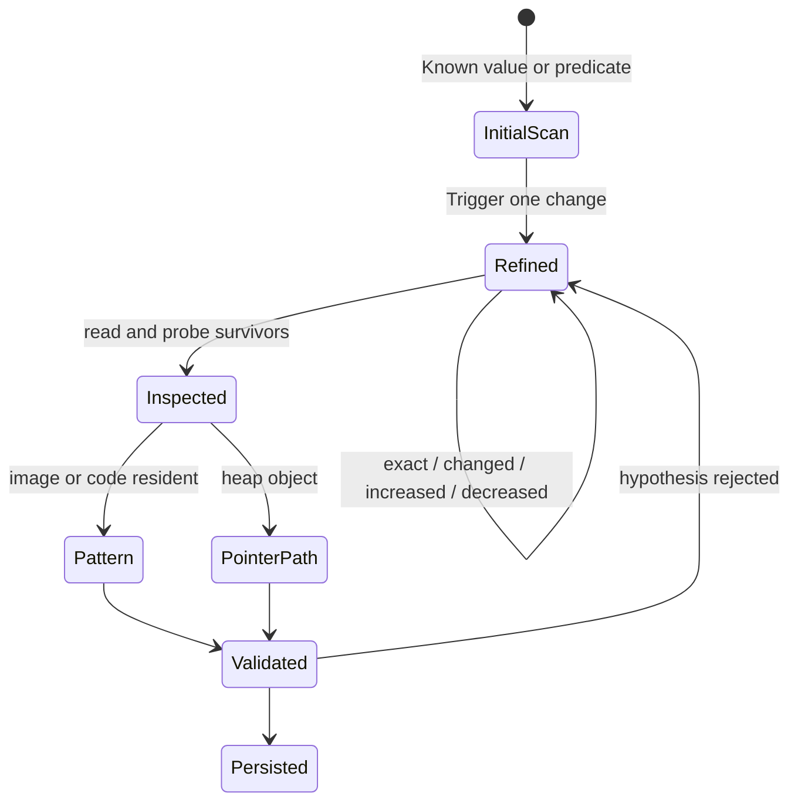
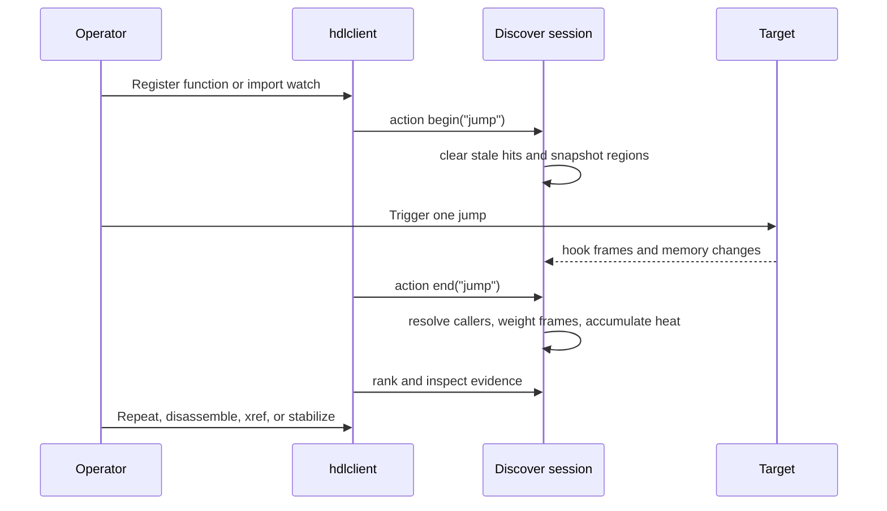
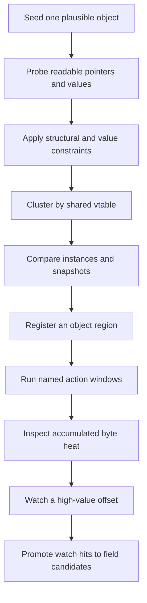
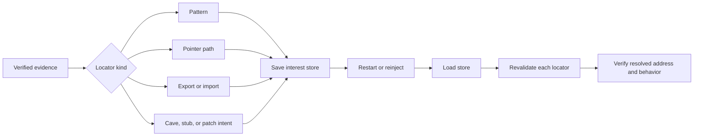
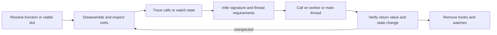
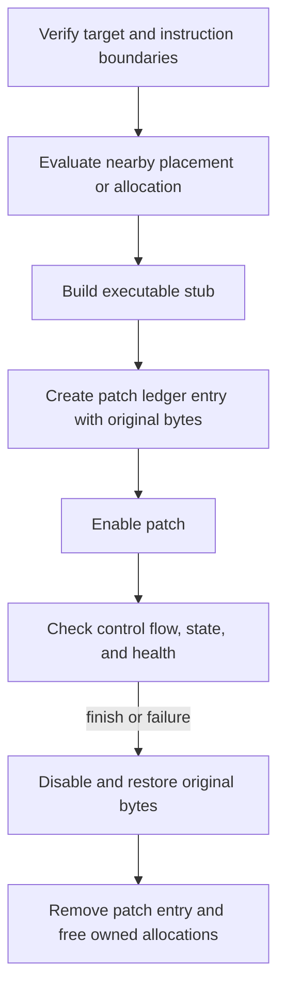

# Goal-oriented workflows

This guide explains what HDLLib lets an operator accomplish, rather than
listing commands one subsystem at a time. Use it to choose a workflow, identify
the evidence it produces, and find the implementation that owns each step.
Exact command syntax lives in [client.md](client.md); API and wire details live
in [capabilities.md](capabilities.md). For a command-by-command investigation
with captured output, use the
[toy arena walkthrough](toy-arena-walkthrough.md).

These workflows assume a Windows x64 process that you own or are authorized to
inspect. Practice mutation-heavy flows against the
[toy arena](../toys/arena/README.md) before using them elsewhere.

## The workflow ladder

Most investigations should move from cheap, passive observations toward
specific, reversible actions:



Do not treat every investigation as a straight line. A strong result often
loops through locate, explain, and validate several times before anything is
saved or changed.

## Choose a workflow

| Desired outcome | Start with | Durable result |
|---|---|---|
| Establish that the target and DLL are healthy | [Connect and characterize](#1-connect-and-characterize-a-target) | Fingerprint and baseline health |
| Find a value that changes with application state | [Find mutable state](#2-find-mutable-state-and-make-it-relocatable) | Pattern or pointer-path locator |
| Identify the code involved in a user action | [Trace an action](#3-find-the-code-responsible-for-an-action) | Ranked functions, evidence, and optionally a pattern |
| Recover related object instances and likely fields | [Recover object structure](#4-recover-object-instances-and-field-layout) | Object candidates, field candidates, and heat |
| Carry findings across ASLR and restarts | [Persist findings](#5-make-findings-survive-aslr-and-restarts) | Revalidatable interest store |
| Confirm and deliberately invoke behavior | [Observe, then invoke](#6-observe-a-behavior-then-invoke-it-deliberately) | Verified calling convention and target |
| Install a reversible code intervention | [Instrument safely](#7-install-reversible-instrumentation) | Patch ledger entry and stub locator |

## Evidence and risk model

HDLLib exposes operations with very different failure modes. Escalate only
when the preceding evidence justifies it.

| Level | Representative operations | Main risk |
|---|---|---|
| Passive inspection | `ping`, `modules`, `fingerprint`, `health`, `read`, PE inspection, disassembly | Stale or misinterpreted evidence |
| Broad discovery | typed scans, pattern search, pointer scans, xrefs, object probing | Cost, noisy candidates, invalidated addresses |
| Intrusive observation | hook tracing, hardware watchpoints, page watches | Timing changes, thread-wide debug state, exception handling interactions |
| Active execution | `call`, `vcall`, main-thread dispatch | Wrong signature, re-entrancy, target crash or hang |
| Mutation | `write`, protection changes, allocation, stubs, patches, injection | Corruption or control-flow failure |

Across all levels:

1. Scope searches to a module, image, or executable region when possible.
2. Name the action or hypothesis being tested.
3. Capture a before state and trigger one controlled change.
4. Confirm the result through a second signal such as a read, xref, watch hit,
   disassembly, or repeated action.
5. Persist the recipe for finding an address, not merely the current address.
6. Remove hooks, watches, and patches when the experiment ends.

## 1. Connect and characterize a target

**Outcome:** a reachable in-process HDLLib instance, a module map, a process
fingerprint, and a clean health baseline.



The recommendation command reports a method; it does not inject. Use
`--then ping` on the actual injection so the client waits for IPC before a
larger workflow and a connection failure is not mistaken for a discovery
failure.

```bat
hdlclient inject --recommend <pid> C:\path\to\hdllib.dll
hdlclient inject <pid> C:\path\to\hdllib.dll --method auto --then ping

hdlclient <pid> modules
hdlclient <pid> fingerprint
hdlclient <pid> health
hdlclient <pid> events --timeout 0 --max 64
```

For exploratory work, open a discover session with an interest-store path and ask for
suggestions:

```bat
hdlclient --store interests.json <pid> session new
hdlclient --store interests.json <pid> recipe suggest
```

`recipe suggest` turns fingerprint facts into copy-and-paste ideas. It does
not run the suggested hooks, watches, or searches. Treat the output as a
triage aid: for example, a Win32 message loop, DXGI presentation path, OpenGL
swap path, or Unity module can provide an initial behavioral anchor.

The injection method also determines prerequisites and observability. See the
[injection selection model](inject/selection.md) before assuming that a method
has the same access, architecture, and loader behavior as another.

**Implementation trail**

- injection selection and execution: [`src/inject/`](../src/inject/)
- target server lifecycle: [`src/ipc/server.cpp`](../src/ipc/server.cpp)
- fingerprinting and suggestions:
  [`src/fingerprint.cpp`](../src/fingerprint.cpp) and
  [`tools/client/recipes.cpp`](../tools/client/recipes.cpp)
- health counters and events: [`src/health.cpp`](../src/health.cpp)

## 2. Find mutable state and make it relocatable

**Outcome:** a large set of value matches is narrowed to a meaningful address,
then expressed as a pattern or pointer path that can be found again.



### Narrow the value

Start a typed scan with the strongest value and region constraints you have.
After causing one controlled state transition, refine the same session using
the relationship between the old and new values.

```text
scan --type i32 --value 100 --max 64
scan --next --session <scan-id> --cmp decreased
scan --next --session <scan-id> --cmp exact --value 90
scan --hits --session <scan-id> --max 64
```

Comparison refinements are more useful than repeatedly starting new scans
because each survivor retains its previous snapshot. Scan sessions live in the
target process, can be shared by connected clients, and should be explicitly
closed when no longer useful.

Read around a surviving address and use `probe` when it may be part of an
object. Check neighboring fields, region protection, module ownership, and
whether the value continues to track the application state.

### Choose the right locator

The current virtual address is evidence, not a durable result:

- For image-resident data or code, synthesize a byte pattern around a discovery
  candidate and require it to remain sufficiently unique.
- For a heap object, find a pointer path from a stable image root. Re-run
  `pathvalidate` after the application reallocates or reloads the object.
- For a public ABI target, prefer an export or import locator over a synthesized
  pattern.

Pattern stabilization (`discover-synth` or the `stabilize` recipe) searches
image bytes, so it is normally appropriate for code or image-resident
candidates, not the heap value itself. Pointer scanning is the usual bridge
from mutable heap state to a stable module-relative root.

Store the selected locator and validate it after both a representative state
change and a fresh process launch:

```bat
hdlclient --store interests.json <pid> discover-pathscan 0xTARGET --store-add player_state
hdlclient --store interests.json <pid> store list
hdlclient --store interests.json <pid> store revalidate
```

See [Interest store and recipes](client.md#4-interest-store-and-recipes)
for the live syntax.

**Implementation trail**

- typed search sessions: [`src/memory.cpp`](../src/memory.cpp) and
  [`tools/client/cmds_scan.cpp`](../tools/client/cmds_scan.cpp)
- pointer paths: [`src/locate.cpp`](../src/locate.cpp)
- discovery candidates and synthesis: [`src/discover.cpp`](../src/discover.cpp)
- interest store: [`tools/client/store.cpp`](../tools/client/store.cpp)

## 3. Find the code responsible for an action

**Outcome:** a deliberately bounded action produces ranked function candidates
and evidence that can be inspected and stabilized.

Begin with a function or import that is plausibly on the action's execution
path. Fingerprint suggestions can provide common anchors; a prior xref,
disassembly, or export lookup can provide a more specific one.



One-shot automation of the direct-function version:

```bat
hdlclient --store interests.json <pid> recipe action jump 0x<known-function> --wait-ms 5000
```

The recipe ensures a discovery session exists, registers the function watch,
begins an action window, waits `--wait-ms` (or `--signal FILE`), ends the window,
ranks functions, and tries to stabilize the top candidate. The direct recipe
is not a substitute for an import watch when the best anchor is an imported
API.

For a manual run:

```text
discover-watch --session <id> --addr 0x<address>
discover-action-begin --session <id> --name jump
# Trigger the action once.
discover-action-end --session <id>
discover-rank --session <id> --name jump
discover-evidence --session <id> --id <candidate-id>
```

Action begin deliberately drains stale hook hits and snapshots registered
memory regions. Action end resolves observed callers and stack frames, then
diffs the registered regions. Frame evidence is weighted more strongly than a
simple caller hit; the resulting rank is still a lead, not proof.

Improve confidence by repeating the same named action and contrasting it with
a control action. Then verify top candidates through disassembly, xrefs,
targeted watchpoints, or a carefully controlled call. Stabilize only after the
candidate behaves consistently.

**Implementation trail**

- action windows and ranking: [`src/discover.cpp`](../src/discover.cpp)
- hook event production: [`src/hooks.cpp`](../src/hooks.cpp)
- client orchestration: [`tools/client/cmds_discover.cpp`](../tools/client/cmds_discover.cpp)
  and [`tools/client/recipes.cpp`](../tools/client/recipes.cpp)

## 4. Recover object instances and field layout

**Outcome:** one suspected object leads to related instances, probable field
offsets, and evidence about which fields participate in a behavior.



Useful sources for a seed include a narrowed typed-scan hit, a return value, a
pointer-path leaf, a `this` pointer observed at a known method, or a global
object export in the toy arena.

Probe the seed before assuming a layout. Then use constraints to describe the
object rather than hard-coding all of its bytes. A common starting point is a
vtable-shaped pointer at offset zero plus one or two plausible scalar fields:

```text
recipe constrain 56 vtable:0 eq_i32:8:100 eq_i32:12:100 --module game.exe
```

Use `--module NAME` when the object is known to live in one image; omit it for
the existing whole-image behavior. Constraint scanning examines aligned candidates and deliberately caps result
counts. The current implementation limits object size and watched-region size
to 4096 bytes, and constraint candidates are scanned at 8-byte alignment.

Cluster candidates by a shared vtable to recover a likely object family. Use
RTTI and vtable inspection where present, but do not assume all programs retain
useful RTTI.

To find behavior-specific fields, register the suspected object region before
an action window:

```text
recipe expand 0x<object> 56
discover-action-begin --session <id> --name damage
# Trigger damage once.
discover-action-end --session <id>
discover-heat --session <id> --addr 0x<object>
```

Region heat accumulates across diffs until the region is re-registered or the
heat is explicitly reset. Repeat one action to strengthen its signal, and run
a control action to distinguish continuously changing fields such as timers.

Once an offset is compelling, a hardware or page watch can identify the code
that accesses it. `discover-apply-watch` consumes recorded watch hits and
promotes offsets inside a known object to field candidates, joining the
dynamic evidence back to the object model.

The toy arena demonstrates this progression with an entity whose vtable is at
offset `0`, health at `8`, and maximum health at `12`; it also tests clustering,
constraints, action ranking, and region heat.

**Implementation trail**

- probing, constraints, clustering, heat, and field promotion:
  [`src/discover.cpp`](../src/discover.cpp)
- vtables and RTTI: [`src/vtable.cpp`](../src/vtable.cpp)
- watchpoints: [`src/watch.cpp`](../src/watch.cpp)
- executable scenario: [`tests/toy_test_main.cpp`](../tests/toy_test_main.cpp)

## 5. Make findings survive ASLR and restarts

**Outcome:** named interests can be re-resolved after module relocation,
allocation churn, or a new process launch.

The interest store persists *how to find* important locations. It complements
discovery export, which persists an investigation snapshot.



| Locator | Best fit | Revalidation behavior |
|---|---|---|
| Pattern | Unique code or image bytes | Searches again and binds a current address |
| Pointer path | Heap object reachable from a stable root | Walks the root and offsets again |
| Export | Named function or global | Resolves the current module export |
| Import | Imported API slot | Resolves the current import binding |
| Cave | Nearby placement capacity | Searches for a suitable cave again |
| Stub | Reconstructible executable helper | Builds a new stub and therefore allocates memory |
| Patch | Saved target and patch intent | Default: re-resolves the target only (does **not** write). With `store revalidate --apply` / `recipe restitch`: recreates the ledger and enables when `enabled_intent` is set |

That last distinction matters: `store revalidate` is not uniformly passive.
A stub locator asks the target to build a fresh executable stub, while a patch
locator only revalidates its target address and does not reapply bytes unless
you pass `--apply`. Always inspect the revalidation results and current health
before acting on them. Unload drops in-target ledger state; durability stays a
client concern.

Typical lifecycle:

```text
store list
store save
# Restart or reinject.
store load
store revalidate
store revalidate --apply   # or: recipe restitch
```

Use discovery export/import when you want to preserve candidates, actions,
evidence, snapshots, and heat for later analysis. Live hooks and watchpoints
are process resources and are not restored by importing that snapshot.

Validation should include more than a successful resolution. Read expected
bytes or fields, verify module ownership, and repeat one known behavior. This
protects against patterns that became ambiguous and pointer paths that still
resolve but now describe a different object.

**Implementation trail**

- store schema, serialization, and revalidation:
  [`tools/client/store.cpp`](../tools/client/store.cpp) and
  [`tools/client/recipes.cpp`](../tools/client/recipes.cpp)
- discovery snapshot export/import: [`src/discover.cpp`](../src/discover.cpp)

## 6. Observe a behavior, then invoke it deliberately

**Outcome:** a function or virtual method is understood well enough to call
with controlled arguments and verify its effects.



Resolve the target through an export, import, pattern, xref, or vtable slot.
Disassemble enough of the function and its callers to understand the likely
argument count, pointer roles, and return shape. Observe the live path before
invoking it: hook tracing can expose callers and frames, while a watchpoint can
confirm that the function touches the state you expect.

HDLLib supports absolute calls, export calls, and virtual calls. A virtual call
prepends the object as `this` by default. Calls can run on the IPC worker or be
marshaled to the target's main UI thread.

Important boundaries:

- the call surface supports at most 16 arguments;
- argument types and the return interpretation must match the actual ABI;
- main-thread dispatch requires a suitable non-console window;
- a timeout does not stop a callee that is already executing;
- a wrong address, signature, object, or thread can crash or deadlock the
  target.

After the call, verify both the returned value and an independent state change.
The toy test, for example, resolves an exported damage function, watches the
health field, invokes the function, polls the watch hit, and reads the updated
value. It separately invokes a vtable slot with the object pointer.

**Implementation trail**

- call engine and main-thread dispatch: [`src/call.cpp`](../src/call.cpp)
- virtual calls: [`src/vtable.cpp`](../src/vtable.cpp)
- hook trace and watches:
  [`src/hooks.cpp`](../src/hooks.cpp) and
  [`src/watch.cpp`](../src/watch.cpp)
- client commands: [`tools/client/cmds_call.cpp`](../tools/client/cmds_call.cpp)

## 7. Install reversible instrumentation

**Outcome:** a verified code target is redirected through an allocated stub
under a patch ledger that can restore the original bytes.

This is the final, mutation-heavy workflow. Establish instruction boundaries
and a recovery path before enabling anything.



Use disassembly to ensure the overwrite length contains complete instructions.
`recipe place` looks for executable code caves near the target and falls back
to a nearby executable allocation, then records the placement interest.

`recipe stitch` builds a stub, creates a NOP-padded jump patch at the target,
and **enables the patch immediately**:

```text
recipe place damage_hook 0x<target>
recipe stitch damage_hook --target 0x<target> --kind mov_rax_jmp --steal-min 12
```

The current stitch recipe does not consume the cave locator saved by
`recipe place`; it asks stub construction to allocate executable memory. Treat
place as a placement assessment and saved interest, not an implicit input to
stitch.

After enabling, verify the intended behavior and inspect health events. Disable
the patch to restore the original bytes, then remove its ledger entry when it
is no longer needed. Free allocations that the workflow owns.

Persistence also has a deliberate safety boundary: revalidating a saved patch
does not enable it. A saved stub may be rebuilt into a new allocation, so
addresses derived from an older stub must not be reused blindly.

Prefer explicit low-level commands when the desired control flow differs from
the stitch recipe. The patch subsystem retains original bytes for reversible
enable/disable operations, but it cannot make a semantically incorrect
trampoline safe.

**Implementation trail**

- code caves and nearby allocation: [`src/place.cpp`](../src/place.cpp)
- stub construction and patch ledger: [`src/code.cpp`](../src/code.cpp)
- recipe composition: [`tools/client/recipes.cpp`](../tools/client/recipes.cpp)

## Worked end-to-end example: toy arena

The [toy arena walkthrough](toy-arena-walkthrough.md) is the concrete,
command-by-command version of this narrative. It includes captured output and
demonstrates:

1. narrowing two `100` values to the changing health field;
2. modifying health and observing target behavior;
3. saving a module-relative pointer path and revalidating it after restart;
4. disassembling damage and correlating it with xrefs and trace-hook arguments;
5. finding executable code caves; and
6. installing and removing a cave-backed detour that suppresses damage.

Read [`toys/arena/README.md`](../toys/arena/README.md) for the target model and
[`tests/toy_test_main.cpp`](../tests/toy_test_main.cpp) for the exact,
assertion-backed sequence.

## Workflow ownership map

| Workflow stage | Primary implementation | Client orchestration | Executable evidence |
|---|---|---|---|
| Connect and health | [`src/core.cpp`](../src/core.cpp), [`src/ipc/`](../src/ipc/), [`src/health.cpp`](../src/health.cpp) | [`tools/client/main.cpp`](../tools/client/main.cpp) | [`tests/test_main.cpp`](../tests/test_main.cpp), [`tests/client_test_main.cpp`](../tests/client_test_main.cpp) |
| Scan and refine | [`src/memory.cpp`](../src/memory.cpp) | [`tools/client/cmds_scan.cpp`](../tools/client/cmds_scan.cpp) | [`tests/test_main.cpp`](../tests/test_main.cpp) |
| Pointer paths | [`src/locate.cpp`](../src/locate.cpp) | [`tools/client/cmds_locate.cpp`](../tools/client/cmds_locate.cpp) | [`tests/test_main.cpp`](../tests/test_main.cpp), [`tests/toy_test_main.cpp`](../tests/toy_test_main.cpp) |
| Action discovery | [`src/discover.cpp`](../src/discover.cpp), [`src/hooks.cpp`](../src/hooks.cpp) | [`tools/client/cmds_discover.cpp`](../tools/client/cmds_discover.cpp), [`tools/client/recipes.cpp`](../tools/client/recipes.cpp) | [`tests/test_main.cpp`](../tests/test_main.cpp), [`tests/toy_test_main.cpp`](../tests/toy_test_main.cpp) |
| Object recovery | [`src/discover.cpp`](../src/discover.cpp), [`src/vtable.cpp`](../src/vtable.cpp) | [`tools/client/cmds_discover.cpp`](../tools/client/cmds_discover.cpp) | [`tests/test_main.cpp`](../tests/test_main.cpp), [`tests/toy_test_main.cpp`](../tests/toy_test_main.cpp) |
| Calls | [`src/call.cpp`](../src/call.cpp), [`src/vtable.cpp`](../src/vtable.cpp) | [`tools/client/cmds_call.cpp`](../tools/client/cmds_call.cpp) | [`tests/toy_test_main.cpp`](../tests/toy_test_main.cpp) |
| Placement and patching | [`src/place.cpp`](../src/place.cpp), [`src/code.cpp`](../src/code.cpp) | [`tools/client/cmds_place.cpp`](../tools/client/cmds_place.cpp), [`tools/client/recipes.cpp`](../tools/client/recipes.cpp) | [`tests/test_main.cpp`](../tests/test_main.cpp), [`tests/toy_test_main.cpp`](../tests/toy_test_main.cpp) |
| Persistence | [`src/discover.cpp`](../src/discover.cpp) | [`tools/client/store.cpp`](../tools/client/store.cpp), [`tools/client/recipes.cpp`](../tools/client/recipes.cpp) | [`tests/store_test.cpp`](../tests/store_test.cpp), [`tests/toy_test_main.cpp`](../tests/toy_test_main.cpp) |

## End-of-session checklist

Before treating an investigation as complete:

- close scan and discovery sessions that are no longer needed;
- unhook traced functions and imports;
- remove hardware and page watches;
- disable enabled patches so original bytes are restored;
- remove obsolete patch entries and free owned allocations;
- save the interest store and any useful discovery snapshot;
- revalidate important locators after a meaningful state transition;
- check `health` and pending events for suppressed faults or resource pressure;
- record which observations were verified and which remain hypotheses;
- when finished with the helper: `hdlclient <pid> shutdown [--modules]` then
  `hdlclient unload <pid> <hdllib.dll> [--modules]` so instrumentation is restored
  before `FreeLibrary` (see [client: clean unload](client.md#clean-unload-leave-the-target-intact)).
